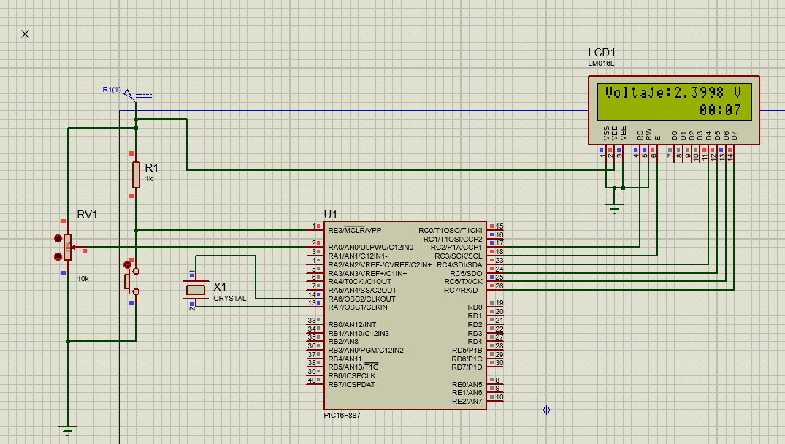

# Practica 10 - Timers e Interrupciones con LCD usando Timer 1
Implementación de un temporizador usando Timer 1 con interrupciones y visualización en display LCD, junto con la lectura de voltaje por ADC con temporizador de actividad usando el microcontrolador PIC16F887.

---
## Actividades
### Clase - Temporizador con Timer 1 en LCD.
Programa que implementa un cronómetro de tiempo en formato MM:SS mostrado en un display LCD usando el Timer 1 del PIC16F887 con interrupciones, siguiendo la misma lógica del Timer 0 de la práctica anterior pero aprovechando las ventajas de los 16 bits del Timer 1.
 - "T1CON = 0b00110001" configura el Timer 1 con prescaler 1:8, reloj interno y el timer encendido. A diferencia de Timer 0 que se configura con "OPTION_REG", Timer 1 tiene su propio registro de control exclusivo donde cada bit define una característica específica del periférico.
 - El valor inicial "TMR1H = 0xF6" y "TMR1L = 0x3C" corresponden a 63036 en decimal, calculado como 65536 - 2500 cuentas. Con Fosc de 8MHz y prescaler 1:8 cada cuenta toma 4µs, por lo que 2500 cuentas equivalen exactamente a 10ms. El valor se divide en dos registros de 8 bits porque el bus de datos del PIC es de 8 bits.
 - Timer 1 es una interrupción periférica, por lo que además de "GIE = 1" requiere "PEIE = 1". Sin esta línea la ISR nunca se dispara aunque el timer esté corriendo, a diferencia del Timer 0 que es una interrupción directa y solo necesita "GIE = 1".
 - La ISR recarga manualmente "TMR1H" y "TMR1L" en cada interrupción igual que se recarga "TMR0" en la práctica anterior, porque el timer arranca desde 0 al desbordarse. "TMR1IF = 0" limpia la bandera al final de la ISR.
 - La lógica del contador auxiliar y el formato MM:SS con "sprintf" es idéntica a la práctica anterior con Timer 0, ya que el comportamiento visible es el mismo. La diferencia está en la precisión: Timer 1 de 16 bits permite intervalos más largos y exactos sin acumular el error de recarga que tiene Timer 0 de 8 bits.

  **Codigo:**   [Timer1_clase.c](./Timer1_clase.c)

  **Esquematico:**  

  **Circuito:**  
[▶ Ver video del circuito](./Timer1_clase.mp4)

---
### Actividad - Voltaje en tiempo real con cronómetro usando Timer 1.
Programa que muestra simultáneamente el voltaje leído desde un potenciómetro en la fila superior del LCD y un cronómetro de tiempo de actividad en la esquina inferior derecha, usando Timer 1 para el conteo y ADC para la lectura analógica.
 - "ADC_Init()" configura RA0 como única entrada analógica con "ANSEL = 0x01". "ADC_Read(channel)" sigue el mismo patrón de prácticas anteriores: limpia los bits de canal con "ADCON0 &= 0x83" y carga el canal con "ADCON0 |= channel << 2".
 - La conversión del ADC a voltaje usa "unsigned long" para evitar overflow, ya que "1023 * 50000 = 51,150,000" supera el límite de "unsigned int" de 65,535. La parte entera se obtiene con "volt / 10000" y la decimal con "volt % 10000", el mismo patrón corregido en prácticas anteriores del ADC.
 - Las etiquetas fijas del LCD ("Voltaje:") se escriben una sola vez antes del while para no desperdiciar ciclos reescribiendo texto que nunca cambia. Solo se actualizan los valores numéricos en cada iteración en sus posiciones fijas con "LCD_Set_Cursor".
 - El timer y el voltaje se actualizan de forma completamente independiente: "TMR1IF" se dispara cada 10ms sin importar el "__delay_ms(200)" del ciclo principal, porque las interrupciones de hardware no son bloqueadas por los delays del programa.
 - El cronómetro se posiciona en la columna 11 de la fila 1 con "LCD_Set_Cursor(1, 11)" para dejarlo en la esquina inferior derecha del LCD de 16 columnas, aprovechando que "MM:SS" ocupa exactamente 5 caracteres.

  **Codigo:**   [Timer1_act.c](./Timer1_act.c)

  **Esquematico:**  

  **Circuito:**  
[▶ Ver video del circuito](./Timer1_act.mp4)

---
## Observaciones
- Timer 1 a diferencia de Timer 0 requiere "PEIE = 1" además de "GIE = 1" porque es una interrupción periférica. Timer 0 e INT (RB0) son interrupciones directas que solo necesitan "GIE = 1".
- El Timer 1 al ser de 16 bits su valor inicial se divide en dos registros de 8 bits ("TMR1H" y "TMR1L") porque el bus de datos del PIC es de 8 bits. Ambos registros deben recargarse en cada ISR para mantener el periodo exacto.
- Los buffers "buf_volt" y "buf_time" se declaran globales para evitar reservar y liberar memoria del stack en cada iteración del while, práctica recomendada en microcontroladores con memoria limitada.
- El uso de "unsigned long" para la conversión del ADC es crítico. Usar "unsigned int" directamente provoca overflow silencioso que genera valores de voltaje incorrectos y aparentemente aleatorios, como se observó al corregir este error en prácticas anteriores del ADC.
