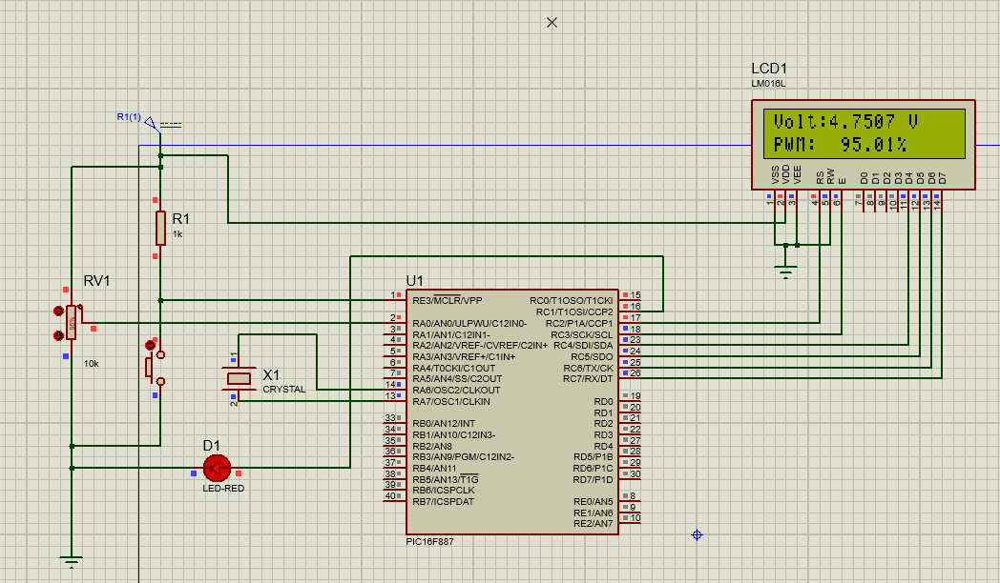
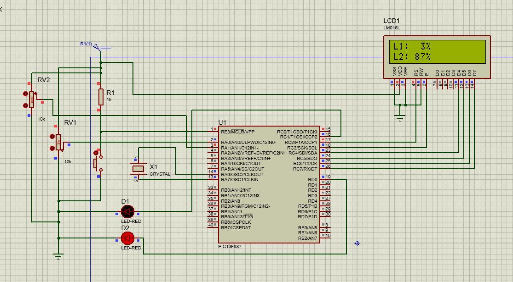
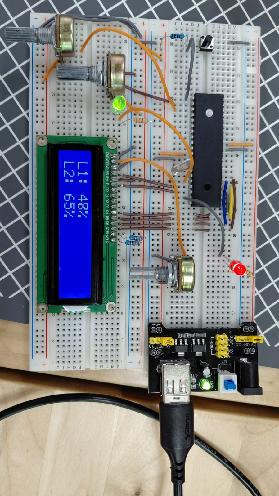

# Practica 11 - PWM por Hardware y PWM por Software
Implementación del control de intensidad de LEDs mediante señales PWM usando el Timer 2 del PIC16F887, combinando PWM por hardware a través del módulo CCP2 y PWM por software mediante interrupciones del Timer 2.

---
## Actividades
### Actividad 1 - Control de intensidad de un LED con potenciómetro (PWM Hardware).
Programa que controla la intensidad de un LED conectado en RC1 usando PWM por hardware a través del módulo CCP2, con la lectura de un potenciómetro en RA0 que determina el duty cycle. El voltaje y el porcentaje de intensidad se muestran en tiempo real en el LCD.
 - "PWM_Init()" configura el módulo CCP2 en modo PWM con "CCP2CON = 0b00001100". Los bits 3-0 con valor "1100" activan el modo PWM. RC1 se usa en lugar de RC2 porque RC2 está ocupado por el LCD, y CCP2 es el único módulo PWM hardware disponible en un pin libre.
 - "PR2 = 255" define el periodo del Timer 2 como su valor máximo, dando la mayor resolución posible al duty cycle. Con prescaler 1:4 y Fosc de 8MHz la frecuencia PWM resultante es "8,000,000 / (4 * 4 * 256) = ~2kHz", suficiente para que el LED no parpadee visiblemente.
 - "PWM_SetDuty(duty)" recibe 0-1023 igual que el ADC y parte los 10 bits en dos registros: los 8 bits altos van a "CCPR2L" con "duty >> 2" y los 2 bits bajos van a los bits 5-4 de "CCP2CON" con "(duty & 0x03) << 4". El mapeo es directo sin conversion porque el ADC y el PWM hardware tienen la misma resolución de 10 bits.
 - La conversion de voltaje usa "unsigned long" para evitar overflow ya que "1023 * 50000 = 51,150,000" supera el límite de "unsigned int". El porcentaje de duty cycle también usa "unsigned long" porque "1023 * 10000 = 10,230,000 > 65535".
 - Las etiquetas fijas del LCD se escriben una sola vez antes del while. Solo los valores numéricos se actualizan en cada iteración, evitando reescribir texto que nunca cambia.

  **Codigo:**   [Practica11_A.c](./Practica11_A.c)

  **Esquematico:**  

---
### Actividad 2 - Control de intensidad de dos LEDs con dos potenciómetros (PWM Hardware y Software).
Programa que extiende la actividad anterior agregando un segundo LED en RD0 controlado por PWM por software usando las interrupciones del Timer 2, mientras el primer LED en RC1 sigue usando PWM por hardware. Cada LED tiene su propio potenciómetro independiente.
 - El segundo LED usa PWM por software porque el PIC16F887 solo tiene dos módulos CCP (CCP1 en RC2 y CCP2 en RC1) y RC2 está ocupado por el LCD. Al no haber más pines de PWM hardware disponibles, se reproduce el comportamiento manualmente en la ISR del Timer 2.
 - "PR2 = 99" reduce el periodo del Timer 2 respecto a la actividad anterior, subiendo la frecuencia PWM a "8,000,000 / (4 * 4 * 100) = 5,000 Hz". La frecuencia más alta reduce el parpadeo visible del LED2 causado por el overhead de cada iteración del ISR.
 - La ISR compara "pwm_cnt" con "duty2" en cada disparo del Timer 2 para decidir si RD0 está encendido o apagado, reproduciendo el mismo principio del PWM hardware pero de forma manual. "pwm_cnt" cicla de 0 a 99 y se resetea con "if(pwm_cnt >= 100) pwm_cnt = 0".
 - "duty2" se mapea de "0-1023" a "0-99" con "((unsigned long)adc2 * 100) / 1023" para que coincida con el rango de "pwm_cnt". El LED1 hardware recibe 0-1023 directo porque su módulo CCP tiene resolución de 10 bits, mientras que el LED2 software trabaja con 8 bits efectivos.
 - "duty2" y "pwm_cnt" se declaran "volatile" porque la ISR las modifica en cualquier momento fuera del flujo normal del while. "ANSEL = 0x03" habilita RA0 y RA1 como entradas analógicas para los dos potenciómetros.
 - Timer 2 cumple doble función en esta actividad: sirve de base de tiempo para el módulo CCP2 que genera el PWM hardware del LED1 de forma automática, y al mismo tiempo genera las interrupciones que el código usa para el PWM software del LED2 manualmente.

  **Codigo:**   [Practica11_B.c](./Practica11_B.c)

  **Esquematico:**  

  **Circuito:**  

---
## Observaciones
- El PWM hardware genera la señal en el pin RC1 de forma completamente autónoma una vez configurado. El módulo CCP2 y el Timer 2 manejan el encendido y apagado del pin sin intervención del código en el while, por lo que no consume ciclos del procesador durante la ejecución.
- El PWM software en cambio requiere que la ISR se ejecute miles de veces por segundo para mantener la señal. Esto consume ciclos del procesador en cada interrupción y puede verse afectado si el while tiene operaciones largas que retrasen la atención de la ISR.
- Ambos LEDs usan el mismo Timer 2 como base de tiempo, lo que los mantiene sincronizados a la misma frecuencia de switching aunque uno sea hardware y el otro software.
- La resolución del PWM hardware es de 10 bits (0-1023) porque usa dos registros para el duty cycle (CCPR2L + 2 bits de CCP2CON). El PWM software tiene resolución efectiva de 8 bits (0-99 en este caso) limitada por el tamaño del contador "pwm_cnt".
- "PR2 = 99" en la actividad 2 cambia la frecuencia respecto a "PR2 = 255" de la actividad 1. Esto afecta tanto al PWM hardware como al software ya que ambos dependen del mismo Timer 2, por lo que siempre comparten la misma frecuencia base.
