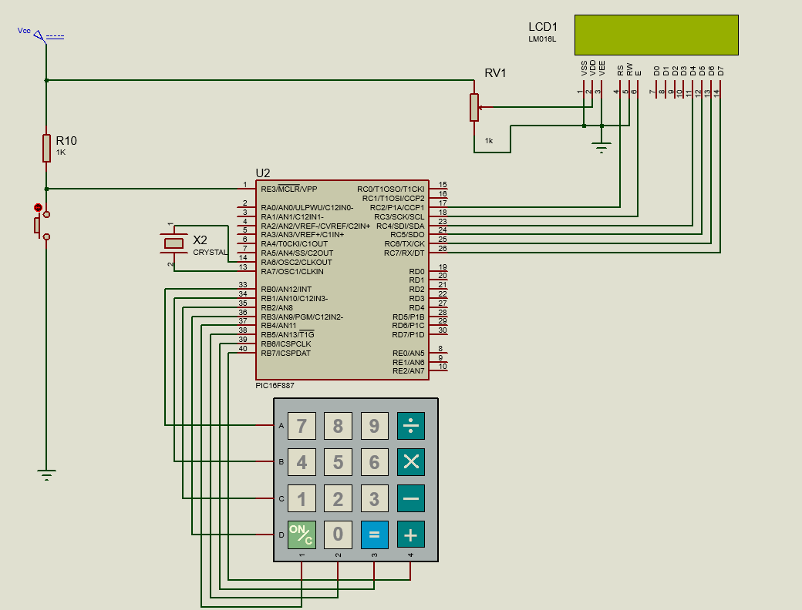
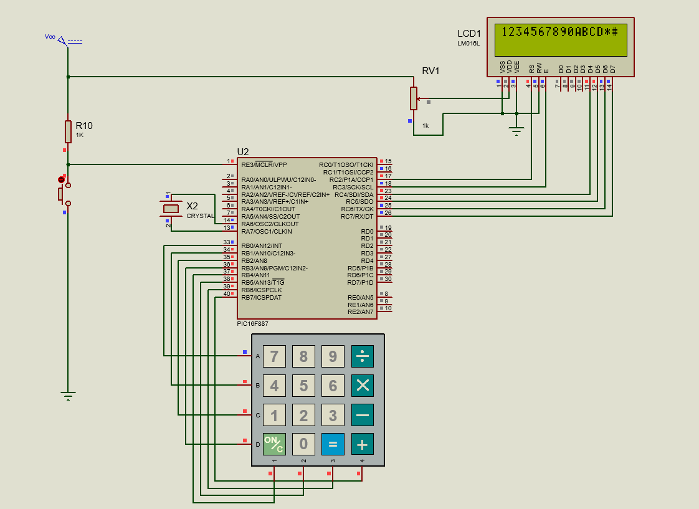
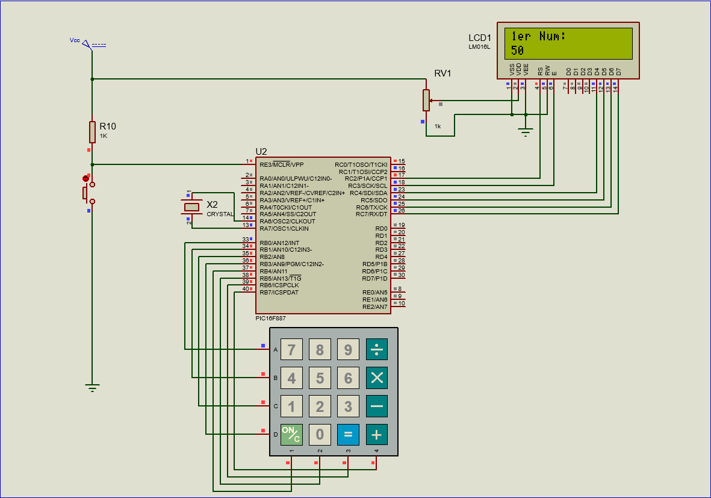
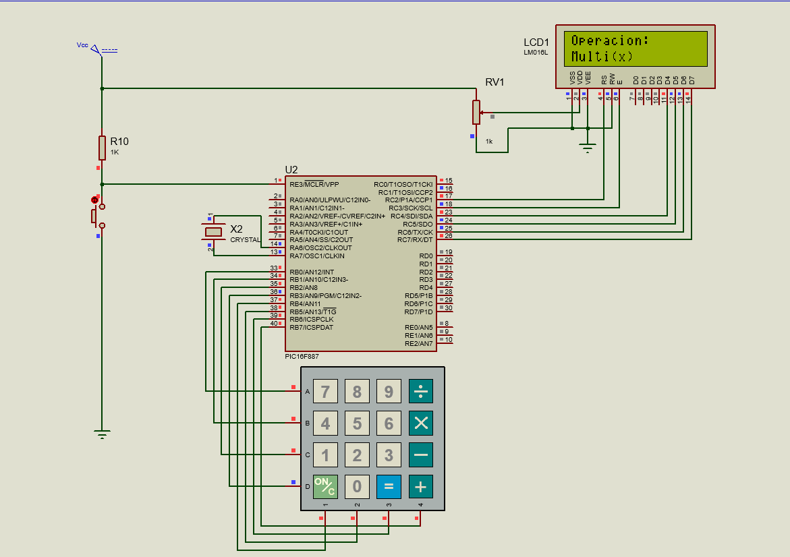
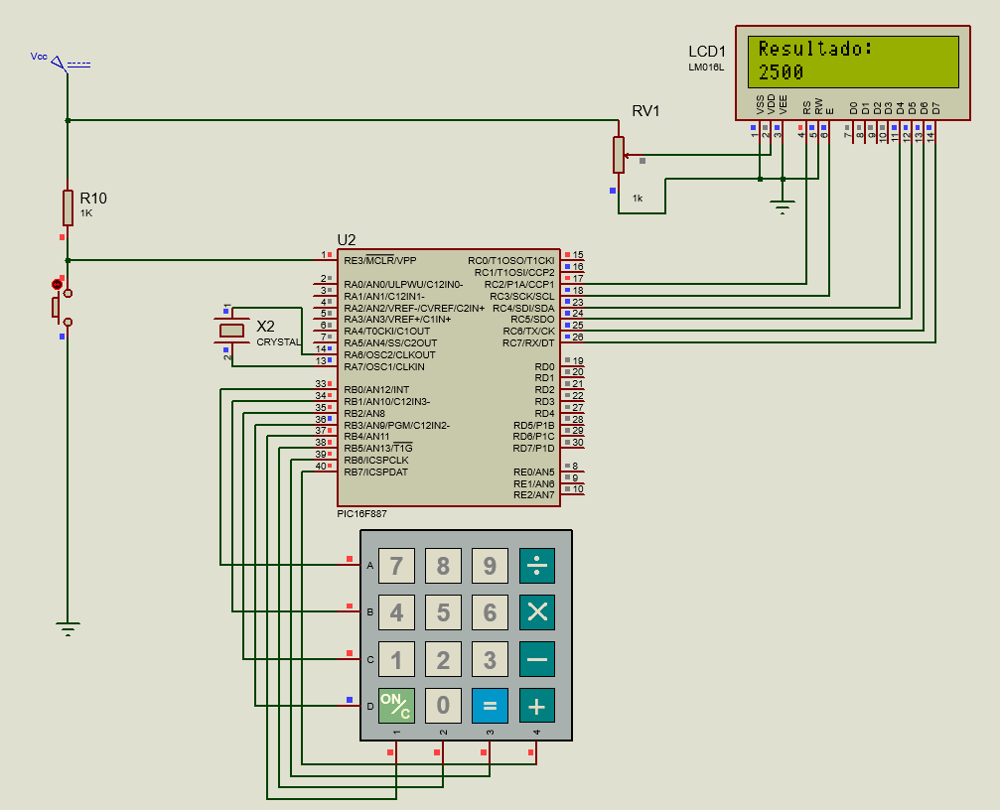

# Practica 12 - Teclado Matricial
Implementación del manejo de un teclado matricial 4x4 junto con una LCD 16x2, mostrando primero la lectura directa de cada tecla presionada y después aplicando esa lectura a una calculadora básica con máquina de estados que realiza las cuatro operaciones aritméticas fundamentales.

---
## Actividades
### Actividad 1 - Escribir en la LCD los caracteres del teclado matricial.
Programa que muestra cada tecla presionada (0-9, A, B, C, D, *, #) directamente en la LCD, llenando primero la línea 1 y después la línea 2. Al llegar al final de la línea 2 se reinicia desde la posición (0,0) sobrescribiendo el contenido anterior.
 - "switch_press_scan()" hace polling bloqueante hasta que el usuario presiona una tecla, por lo que el "while" principal no necesita lógica adicional de espera.
 - "Escribir_Caracter()" usa dos variables globales, "fila_actual" y "columna_actual", para llevar el rastro de la posición del cursor en la LCD sin tener que leerla del propio módulo.
 - Cuando "columna_actual" llega a "COLUMNAS_LCD" (16), se reinicia a 0 y se avanza a la siguiente fila. Si la fila supera 1 (ya se llenaron ambas líneas), se reinicia "fila_actual" a 0 y se limpia la LCD con "LCD_Clear()" antes de seguir escribiendo desde el inicio.
 - No se usa ningún buffer de texto: cada tecla se imprime con "LCD_putc()" en el momento exacto en que se presiona, evitando el riesgo de overflow asociado a acumular caracteres en un arreglo.

  **Codigo:**   [Teclado.c](./Teclado.c)

  **Esquematico:**  

  **Prueba:**  

---
### Actividad 2 - Calculadora básica con teclado matricial y LCD.
Programa que implementa una calculadora con máquina de estados de 4 etapas: ingreso del primer número, selección de operación, ingreso del segundo número y despliegue del resultado. Las teclas A, B, C y D seleccionan división, multiplicación, resta y suma respectivamente, mientras que '*' confirma cada etapa y '#' borra el último dígito ingresado.
 - La máquina de estados se controla con la variable "estado_actual" y un "switch" dentro de "Procesar_Tecla()" que decide qué hacer con cada tecla según la etapa en la que se encuentre el programa: "ESTADO_NUM1 -> ESTADO_OPERACION -> ESTADO_NUM2 -> ESTADO_RESULTADO".
 - Los números se acumulan como texto en "buffer_num1"/"buffer_num2" en lugar de convertirse a entero en cada tecla, lo que permite borrar el último dígito con '#' simplemente retrocediendo "pos_num1"/"pos_num2" y colocando un '\0' en esa posición, sin tener que reconstruir el número completo.
 - Ambos buffers están limitados a 6 dígitos ("sizeof(buffer_num1) - 1") para no exceder el rango seguro de "long" en operaciones posteriores como la multiplicación.
 - No se usa "sprintf" en ningún punto del código. "Numero_A_Texto()" convierte manualmente un "long" a texto extrayendo dígitos de derecha a izquierda con "% 10" y "/ 10", e invierte el orden al final; "Texto_A_Numero()" hace el proceso inverso acumulando "resultado = (resultado * 10) + (texto[i] - '0')".
 - La división se calcula con dos decimales sin usar tipos "float": "((unsigned long) num1 * 100UL) / (unsigned long) num2" desplaza el resultado dos posiciones antes de dividir, y después se separa en parte entera ("/ 100") y parte decimal ("% 100"). Se castea a "unsigned long" porque "num1 * 100" puede exceder el rango de un entero de 16 bits.
 - División entre cero se valida explícitamente antes de calcular, mostrando "Error: /0" en la LCD en lugar de dejar que el PIC ejecute la división.
 - "Numero_A_Texto()" maneja números negativos invirtiendo el signo internamente y agregando el carácter '-' al inicio del texto de salida; este caso solo puede ocurrir en una resta donde "num1 < num2".
 - Cada cambio de estado llama a su propia función de pantalla ("Mostrar_Num1()", "Mostrar_Operacion()", "Mostrar_Num2()", "Mostrar_Resultado()"), y cada una de estas funciones limpia la LCD antes de escribir, evitando que se mezclen caracteres de la pantalla anterior con la nueva.

  **Codigo:**   [Calculadora.c](./Calculadora.c)

  **Esquematico:**  

  **Prueba - Ingreso de Num1:**  

  **Prueba - Selección de Operación:**  

  **Prueba - Resultado:**  

---
## Observaciones
- Ambas actividades comparten el mismo principio de lectura: "switch_press_scan()" bloquea el programa hasta detectar una tecla, por lo que no se necesita ningún tipo de debounce manual ni verificación adicional en el "while(1)".
- La Actividad 1 trabaja directamente con el carácter recibido del teclado sin ningún procesamiento, mientras que la Actividad 2 interpreta ese mismo carácter según el contexto de la máquina de estados, demostrando cómo la misma entrada física puede tener significados distintos dependiendo del estado del programa.
- Mantener los números como texto en lugar de convertirlos a entero en cada pulsación simplifica enormemente el borrado de dígitos con '#'; convertir a entero solo ocurre una vez, al momento de calcular el resultado.
- El manejo manual de conversión numérica (sin "sprintf") es consistente con la restricción del PIC16F887 de no usar librerías estándar de "stdio.h" por el límite de pila de 8 niveles.
- Limpiar la LCD completa en cada cambio de pantalla ("Mostrar_*") es una solución simple pero efectiva para evitar caracteres residuales, a costa de un parpadeo visual breve en cada actualización; una alternativa más compleja sería sobrescribir solo los caracteres necesarios.
