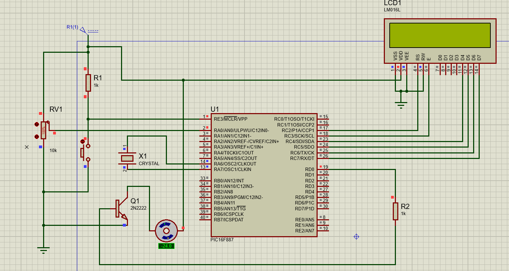
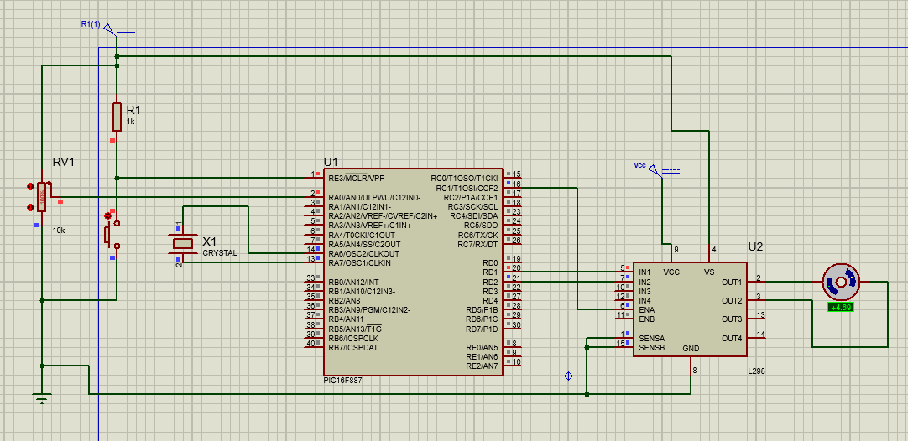
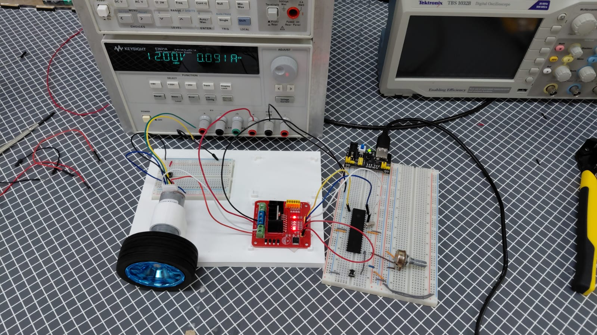

# Practica 13 - Motor DC
Implementación del control de velocidad y dirección de un motor DC usando PWM por hardware con el módulo CCP2 del PIC16F887, primero mediante un circuito driver basado en transistor BJT y posteriormente usando un puente H L298.

---
## Actividades
### Actividad 1 - Control de velocidad con circuito driver BJT.
Programa que controla la velocidad de giro de un motor DC usando PWM por software con Timer 2 e interrupciones, donde un transistor BJT actúa como driver amplificando la corriente del PIC hacia el motor. La velocidad se controla con un potenciómetro en RA0.
 - El PIC no puede alimentar el motor directamente porque cada pin entrega máximo ~25mA mientras que un motor DC necesita varios cientos de mA. El BJT actúa como interruptor controlado: la señal PWM del PIC entra por la base y controla si la corriente de la fuente de alimentación del motor fluye por el colector hacia el motor o se corta.
 - La señal PWM en RD0 se genera por software con interrupciones del Timer 2, comparando "pwm_cnt" con "duty" en cada disparo de la ISR para decidir si el pin está encendido o apagado, siguiendo el mismo principio de la práctica 11.
 - El duty cycle se mapea del ADC (0-1023) a un rango de 0-99 con "((unsigned long)adc * 99) / 1023" para que coincida con el contador "pwm_cnt". Se usa "unsigned long" para evitar overflow ya que "1023 * 99 = 101,277 > 65535".
 - "TRISD = 0x00" configura todo el PORTD como salida.
 
  **Codigo:**   [MotorDC_1.c](./MotorDC_1.c)

  **Esquematico:**  

---
### Actividad 2 - Control de velocidad y dirección con puente H L298.
Programa que controla tanto la velocidad como el sentido de giro de un motor DC usando el puente H L298, donde el potenciómetro funciona como un control bidireccional: girar a la derecha del centro activa el giro hacia adelante con velocidad creciente, girar a la izquierda activa la reversa, y el centro frena el motor.
 - El L298 es un puente H doble que resuelve dos problemas del control directo con BJT: amplifica la corriente para el motor (hasta 2A por canal) y permite invertir la polaridad del voltaje sobre el motor para cambiar el sentido de giro, algo que un BJT simple no puede hacer.
 - "ENA" del L298 recibe la señal PWM por hardware del módulo CCP2 en RC1 para controlar la velocidad. "IN1" en RD1 e "IN2" en RD2 controlan la dirección: "IN1=1, IN2=0" gira hacia adelante, "IN1=0, IN2=1" gira en reversa, "IN1=0, IN2=0" frena el motor.
 - El potenciómetro se divide en tres zonas alrededor del centro del ADC (512): por encima de "CENTRO + ZONA_MUERTA" (542) activa el giro hacia adelante, por debajo de "CENTRO - ZONA_MUERTA" (482) activa la reversa, y entre ambos umbrales el motor queda frenado. La zona muerta de ±30 cuentas evita que el motor vibre cuando el potenciómetro está cerca del centro.
 - La velocidad en cada dirección se mapea de forma proporcional desde el borde de la zona muerta hasta el extremo del ADC, no desde 0. Esto garantiza que al salir de la zona muerta el motor arranque desde 0% de velocidad y suba gradualmente hasta el 100%, evitando saltos bruscos.
 - "unsigned long" se usa en el cálculo del duty cycle para evitar overflow: "velocidad * 1023" puede superar 65535 dependiendo del valor del ADC.
 - "SENSA" y "SENSB" del L298 deben conectarse a GND para que el puente H permita el paso de corriente. Si quedan flotantes el L298 bloquea sus salidas como medida de protección de corriente y el motor no gira.
 - El pin "VS" del L298 (lógica) se alimenta con 5V para ser compatible con las señales del PIC. El pin "VCC" (potencia) se alimenta con el voltaje nominal del motor (12V en este caso) para que gire a su velocidad correcta. Ambas fuentes deben compartir el mismo GND con el PIC.

  **Codigo:**   [MotorDC_2.c](./MotorDC_2.c)

  **Esquematico:**  

  **Circuito:**  

[▶ Ver video del circuito](./Practica13.mp4)

---
## Observaciones
- El BJT de la actividad 1 solo permite controlar la velocidad del motor en un único sentido de giro. El puente H de la actividad 2 agrega la capacidad de invertir la dirección controlando qué par de transistores internos conduce, haciendo fluir la corriente en sentido contrario por el motor.
- "SENSA" y "SENSB" del L298 son pines de detección de corriente diseñados para conectar una resistencia externa y medir la corriente del motor. Al conectarlos directamente a GND se omite esta función y se permite que la corriente fluya libremente sin límite de protección por software.
- El puente H requiere dos fuentes de voltaje separadas: 5V para la lógica (compatible con el PIC) y el voltaje nominal del motor para la potencia. Si ambas se conectan a 5V el motor gira pero con muy poca fuerza. Ambas fuentes deben compartir el mismo GND o el L298 no tiene referencia común y no funciona.
- La zona muerta alrededor del centro del ADC es necesaria porque en la práctica es imposible dejar el potenciómetro exactamente en 512. Sin ella el motor recibiría pequeños pulsos de dirección alterna al intentar centrarlo, causando vibración o movimientos no deseados.
