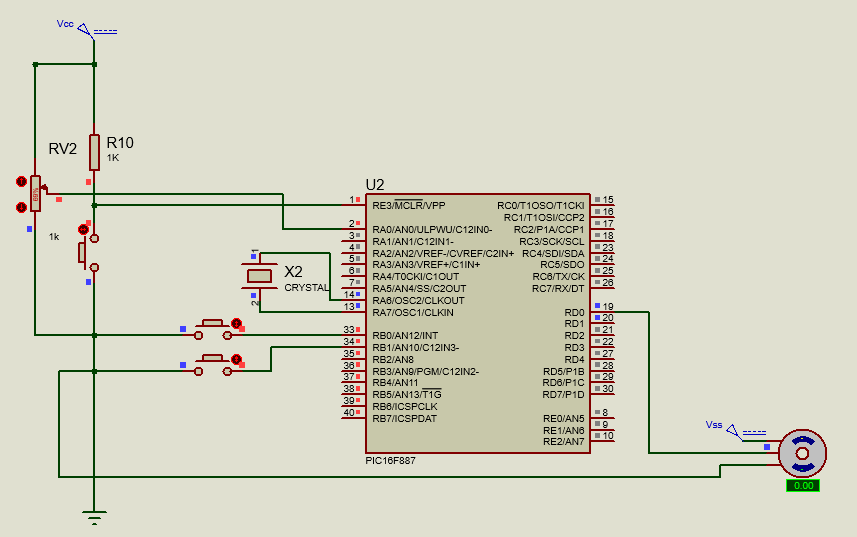
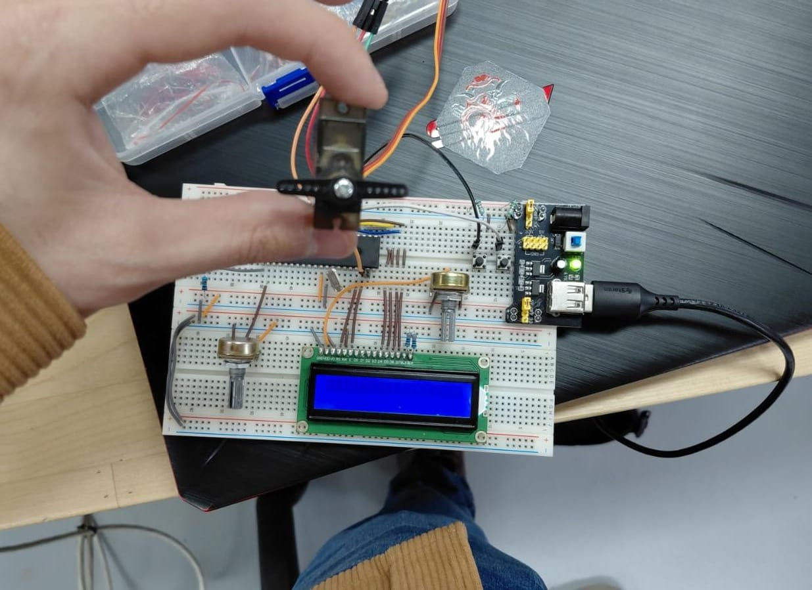

# Practica 14 - Servomotores
Implementación del control de un servomotor mediante señales de control por software (sin módulo PWM hardware), primero alternando entre dos posiciones fijas con botones y después variando el ángulo de forma proporcional con un potenciómetro leído por ADC, usando el microcontrolador PIC16F887.

---
## Actividades
### Actividad 1 - Control de ciclo 0°-180° con botones.
Programa que mueve un servomotor entre las posiciones de 0° y 180° usando dos botones: uno fija el servo en 180° y el otro lo regresa a 0°, manteniendo la posición mientras ningún botón se presiona.
 - "p0()" y "p180()" generan el pulso de control enviando un nivel alto en "SERVO" durante "400µs" o "2600µs" respectivamente, seguido de un nivel bajo de "18ms" para completar el periodo de refresco típico de un servo (~20ms).
 - Los botones se leen con resistencias pull-up internas habilitadas mediante "OPTION_REGbits.nRBPU = 0" junto con "WPUB0 = 1" y "WPUB1 = 1", por lo que ambos botones se consideran presionados en estado bajo (lógica activa en 0).
 - La variable "angulo_actual" funciona como bandera de estado: una vez que un botón cambia su valor, el "while(1)" sigue reenviando el pulso correspondiente en cada vuelta aunque el botón ya no esté presionado, manteniendo el servo en la última posición confirmada.
 - Antes de entrar al "while(1)" se envían 20 pulsos consecutivos de "p0()" en un ciclo "for" para estabilizar el servo en la posición inicial de 0°, ya que un servo necesita varios pulsos repetidos para alcanzar y sostener una posición física real.
 - No se usa ningún temporizador ni interrupción: el propio "while(1)" actúa como el generador continuo de pulsos, revisando el estado de los botones en cada vuelta antes de decidir qué pulso enviar.

  **Codigo:**   [Servo_act1.c](./Servo_act1.c)

  **Esquematico:**  

  **Circuito:**  

---
### Actividad 2 - Control de ángulo proporcional con potenciómetro (ADC).
Programa que lee un potenciómetro por ADC en RA0 y mapea su valor a 23 posiciones discretas del servomotor (0° a 180° en pasos de aproximadamente 8.18°), seleccionando el pulso correspondiente mediante una cadena de comparaciones "else if".
 - Se definen 23 funciones de pulso fijo ("p00()" a "p22()"), cada una con un ancho de pulso que aumenta en pasos exactos de "100µs" (desde "400µs" hasta "2600µs"), cubriendo el mismo rango físico de 0° a 180° usado en la Actividad 1.
 - "ADC_Read()" no recibe parámetro de canal porque "ADC_Init()" ya fija el canal 0 de forma permanente en "ADCON0 = 0x01"; a diferencia de otras prácticas, aquí no se reconfigura el canal en cada lectura porque solo existe un potenciómetro conectado.
 - El valor de 10 bits del ADC (0-1023) se divide en 23 rangos mediante una cadena de "else if" con saltos de aproximadamente "44-45" unidades ADC por rango, en lugar de calcular el pulso dinámicamente con una fórmula de interpolación; cada rango activa directamente la función de pulso fija correspondiente a ese ángulo.
 - Este enfoque de funciones discretas evita el cálculo de "duty"/ancho de pulso en tiempo real, a costa de una resolución angular fija de 23 posiciones en lugar de un mapeo continuo de los 1024 valores posibles del ADC.
 - Igual que en la Actividad 1, se envían 20 pulsos de "p00()" antes del "while(1)" para estabilizar el servo en 0° al iniciar, y cada función de pulso mantiene el mismo patrón de "18ms" en bajo para respetar el periodo de refresco del servo.

  **Codigo:**   [Servo_actB.c](./Servo_actB.c)

  **Esquematico:**  

  **Circuito:**  

---
## Observaciones
- Ambas actividades generan el pulso de control por software con "__delay_us()"/"__delay_ms()" en lugar de usar el módulo CCP (PWM hardware), por lo que el procesador queda completamente dedicado a sostener la señal del servo y no puede atender otras tareas mientras el "while(1)" está corriendo.
- La Actividad 1 maneja solo 2 posiciones discretas controladas por evento (botón presionado), mientras que la Actividad 2 maneja 23 posiciones discretas controladas por una lectura continua del ADC; ambas evitan el cálculo dinámico del ancho de pulso, pero la Actividad 2 requiere una tabla de funciones más extensa para aproximar un movimiento proporcional.
- Usar 23 funciones de pulso fijo en vez de una sola función parametrizada con el ancho de pulso como argumento es una solución más repetitiva en código, pero evita pasar valores variables a "__delay_us()", que en XC8 solo acepta constantes conocidas en tiempo de compilación.
- En ambas actividades, estabilizar el servo con 20 pulsos repetidos antes de iniciar el ciclo principal es necesario porque un solo pulso no es suficiente para que el servo alcance físicamente la posición indicada.
- El mismo esquemático y circuito físico sirven para ambas actividades porque la única diferencia de hardware es el potenciómetro conectado a RA0 en la Actividad 2, mientras que la señal de control del servo permanece en RD0 en ambos casos.
