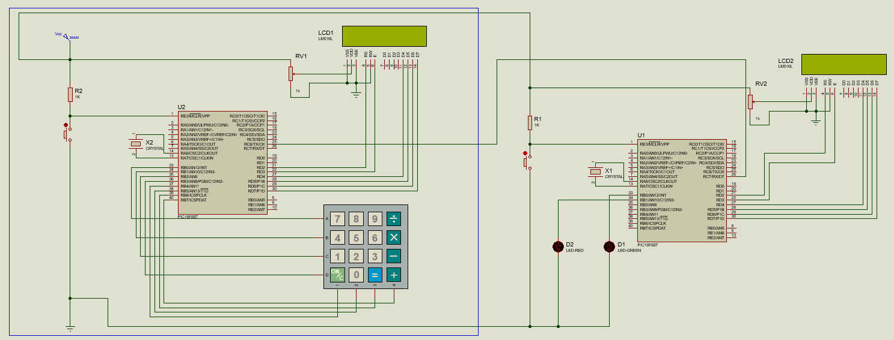
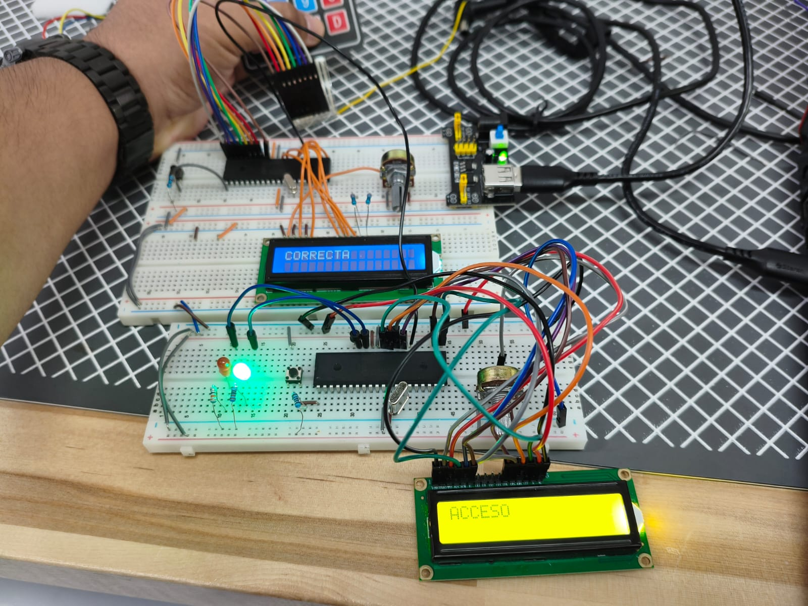
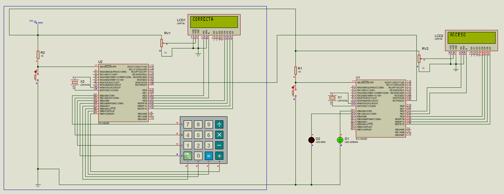
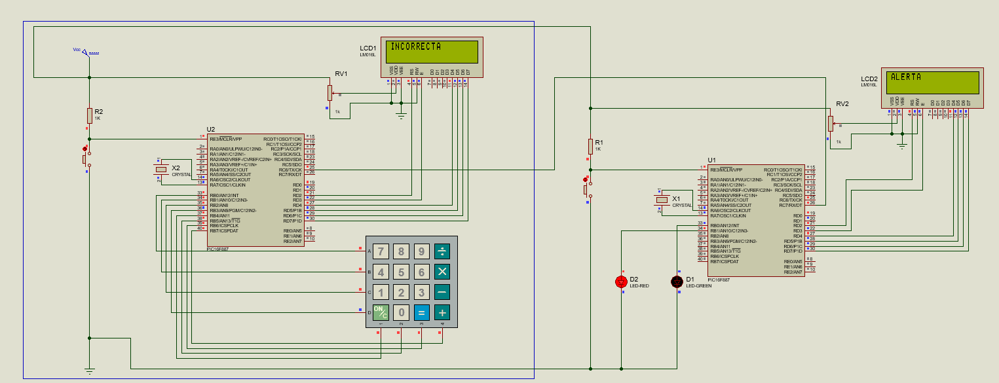

# Practica 15 - Comunicación Serial UART entre dos PIC
Implementación de un sistema de control de acceso por contraseña usando dos microcontroladores PIC16F887 comunicados mediante el módulo EUSART en modo UART. El PIC Maestro captura la contraseña desde un teclado matricial y la valida localmente, enviando únicamente el resultado (correcto/incorrecto) al PIC Esclavo, que reacciona mostrando el mensaje en su propio LCD y activando LEDs indicadores.

---
## Actividades
### Actividad Única - Sistema Maestro/Esclavo con validación de contraseña vía UART.
Programa dividido en dos PIC: el Maestro recibe la contraseña por teclado matricial, la compara contra una contraseña fija y transmite por UART un solo byte indicando el resultado. El Esclavo recibe ese byte por interrupción y despliega el resultado en su LCD, además de encender un LED verde (acceso correcto) o parpadear un LED rojo (acceso incorrecto).
 - "Init_UART()" configura el módulo EUSART en modo asíncrono con "SPBRG = 51" y "BRGH = 1", lo que da 9600 baudios reales a 8MHz con un error mínimo. Ambos PIC usan la misma configuración de baudios para mantener la comunicación sincronizada.
 - El Maestro solo necesita transmitir, por lo que configura "TXEN = 1" y deja "TRISC7 = 1" en alto sin usarlo. El Esclavo solo necesita recibir, por lo que configura "CREN = 1" y deja "TRISC6 = 0" configurado como salida sin transmitir nada.
 - La validación de la contraseña ocurre completamente en el Maestro mediante "Verificar_Contrasena()", que compara byte a byte el buffer ingresado contra "contrasena_correcta". El Esclavo nunca conoce la contraseña real, solo recibe el resultado booleano codificado como "UART_OK" ('1') o "UART_FAIL" ('0').
 - Se transmite un solo carácter ASCII en lugar de toda la contraseña para minimizar el tráfico serial y evitar exponer la contraseña en el bus de comunicación. "UART_Write()" espera la bandera "TXIF" antes de escribir en "TXREG", garantizando que el byte anterior ya fue enviado.
 - El Esclavo recibe el dato exclusivamente por interrupción ("RCIE = 1", "PEIE = 1", "GIE = 1") en lugar de polling, ya que debe quedar libre para hacer otras tareas (refrescar LCD, etc.) mientras espera un byte que puede llegar en cualquier momento. La ISR solo lee "RCREG" y levanta una bandera "dato_disponible"; toda la lógica de despliegue se ejecuta después, dentro del "while(1)" del main.
 - Tanto "dato_recibido" como "dato_disponible" se declaran "volatile" porque son modificadas dentro de la ISR y leídas en el flujo principal del programa.
 - El LCD de ambos PIC se conecta en PORTD (RD2-RD7) en lugar de PORTC para evitar conflicto con los pines RC6/RC7 que usa el módulo EUSART para TX/RX.

  **Codigo Maestro:**   [Com_Maestro.c](./Com_Maestro.c)
  **Codigo Esclavo:**   [Com_Esclavo.c](./Com_Esclavo.c)

  **Esquematico:**  

  **Circuito Físico:**  

  **Visualización - Contraseña correcta:**  

  **Visualización - Contraseña incorrecta:**  

---
## Observaciones
- La comunicación es unidireccional (Maestro → Esclavo). El Maestro nunca espera una respuesta del Esclavo, por lo que no hay riesgo de bloqueo mutuo ni necesidad de protocolo de confirmación (ACK).
- Repartir las responsabilidades entre ambos PIC reduce el acoplamiento del sistema: el Maestro concentra la lógica de entrada/validación y el Esclavo concentra la lógica de salida/indicación visual, comunicados por un canal mínimo de un solo byte.
- El uso de interrupción en el Esclavo (en vez de polling sobre "RCIF") es la diferencia clave frente a prácticas anteriores con UART unidireccional simple: permite que el Esclavo no dependa de revisar constantemente el puerto serie y pueda ejecutar otras tareas sin perder el byte entrante.
- Al recibir "UART_FAIL", el Esclavo bloquea su propio "while" durante los 3 segundos del parpadeo del LED rojo ("Mostrar_Alerta()"). Durante ese lapso no atiende nuevos datos entrantes en el "while(1)", aunque la ISR seguiría disparándose si llegara un byte nuevo y simplemente actualizaría "dato_recibido" para cuando el flujo principal vuelva a revisar la bandera.
- "ANSELH = 0" en el Esclavo es necesario porque RB0/RB1 comparten función con canales analógicos (AN12/AN10) en el PIC16F887; sin esta línea los LEDs no funcionarían correctamente como salidas digitales.
- Ambos códigos reutilizan la misma estructura de configuración de bits (fuses) y los mismos parámetros de "_XTAL_FREQ" y baudios, lo cual es indispensable: si los dos PIC no coinciden exactamente en "SPBRG"/"BRGH", la trama UART se desincroniza y los datos llegan corruptos aunque el cableado esté correcto.
