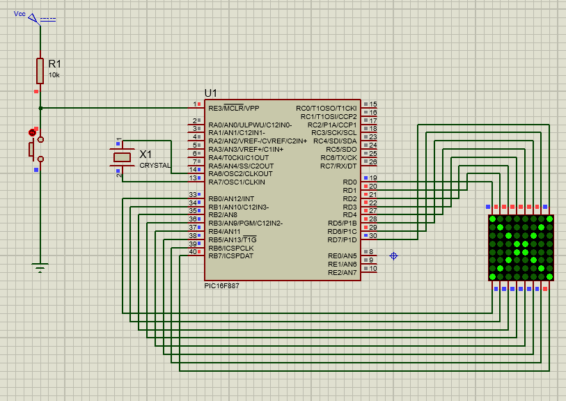
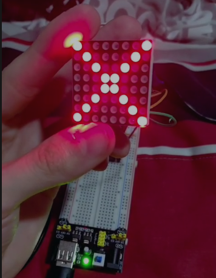

# Practica 2 - Configuración de Mátriz LED 8x8
Manejo de salidas digitales mediante el microcontrolador PIC16F887, implementando una matriz LED de 8x8 para formar figuras y letras.
  **Esquematico:**  

  **Circuito:**  

---
## Actividades
### Clase - Configuración X en la matriz
Configuración para que la matriz 8x8 muestre la figura X uasndo los puertos B para las filas de la matriz y D para las columnas.
  **Codigo:**   [X.c](./X.c)
  **Foto:**  

---
### Actividad 1 - Configuración de letras R E A L
Configuramos la matriz para que se muestre 4 letras que forman parte de los nombres de los integrantes del equipo. R y A de RAFAEL, E y L de EMILIO.
  **Codigo:**   [REAL.c](./REAL.c)

---
## Observaciones
- See utiliza el datasheet para poder observar que columna se representa por el número de pin circulado en la matriz fisica.
- La matriz tiene un número de serie en uno de los costados, esto indica donde inicia el pin 1 a 8 de izquierda a derecha y atras los pines 9 a 16 de derecha a izquierda.
- El acomodo de pines no sigue el orden de proteus y en lugar se debe realizar con el datasheet de la matriz.
