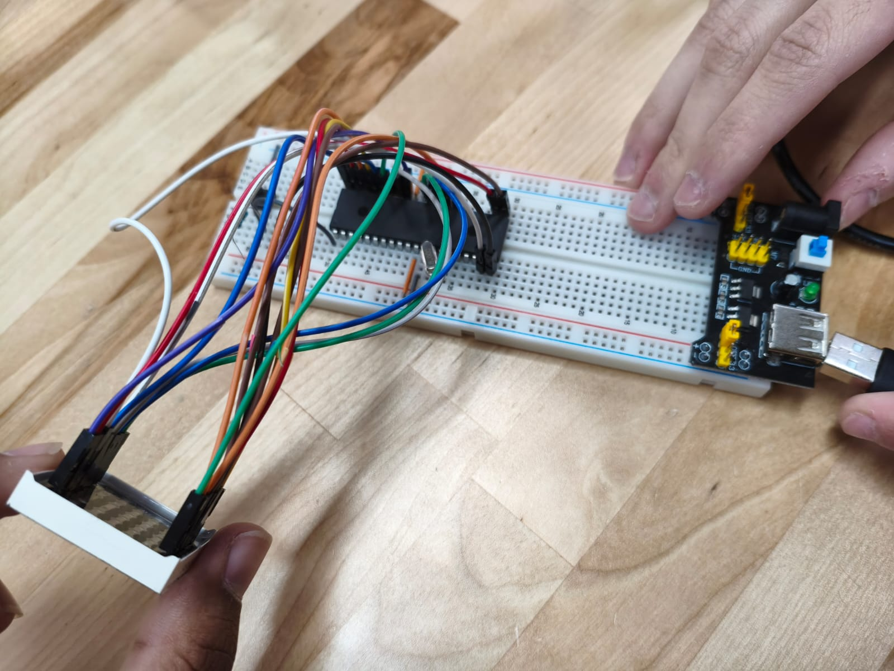

# Practica 2 - Configuración de Mátriz LED 8x8
Manejo de salidas digitales mediante el microcontrolador PIC16F887, implementando una matriz LED de 8x8 para formar figuras y letras.
  **Esquematico:**  

  **Circuito:**  

---
## Actividades
### Clase - Configuración X en la matriz
Configuración para que la matriz 8x8 muestre la figura X uasndo los puertos B para las filas de la matriz y D para las columnas.
**Codigo:** [X.c](./X.c)
  **Foto:**  

---
### Actividad 1 - Configuración de letras R E A L
Configuramos la matriz para que se muestre 4 letras que forman parte de los nombres de los integrantes del equipo. R y A de RAFAEL, E y L de EMILIO.
**Codigo:** [Contador_6_bits.c](./Contador_6_bits.c)
**Esquematico:**

**Circuito:**

---
## Observaciones
- 
