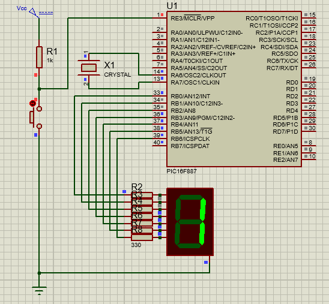
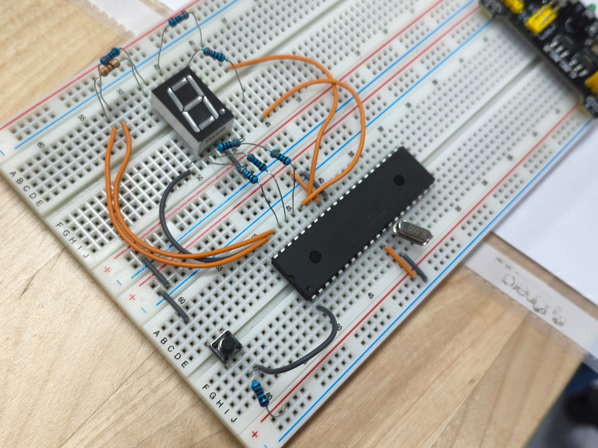

# Practica 3 - Contadores
Implementación de contador decimal y hexadecimal mediante el manejo de salidas digitales con el microcontrolador PIC16F887.
 **Esquematico:**  

  **Circuito:**  

---
## Actividades
### Clase - Contador Decimal (0 a 9)
Programa que implementa un contador incremental en base 10 (decimal) empleando un display de 7 segmentos conectados a los pines del PIC16F887. Se configuran los puertos como salidas digitales (TRIS) y se envía la secuencia de estados lógicos (PORTB) del 0 al 9 de forma cíclica con retardos de tiempo.
  **Codigo:**   [Contador Decimal.c](./Contador_0-9.c)

---
### Actividad 1 - Contador Hexadecimal (0 a F)
Programa diseñado para realizar un conteo secuencial en base 16 (hexadecimal) desde el 0 hasta la F ($15$ en decimal). Se utiliza un display de 7 segmentos conectado a los pines del PIC16F887, manipulando los registros de salida para mostrar los caracteres alfanuméricos correspondientes (0-9 y A-F) mediante el mapeo de bits correspondientes.
  **Codigo:**   [Contador Hexadecimal.c](./Contador_0-F.c)

---
## Observaciones
- Los registros TRIS deben configurarse en 0x00 para definir el puerto como salida antes de cualquier operacion.
- Se utilizo la funcion __delay_ms() para controlar los tiempos de cada secuencia.
- 0x00 = 0x00000000 = 0
