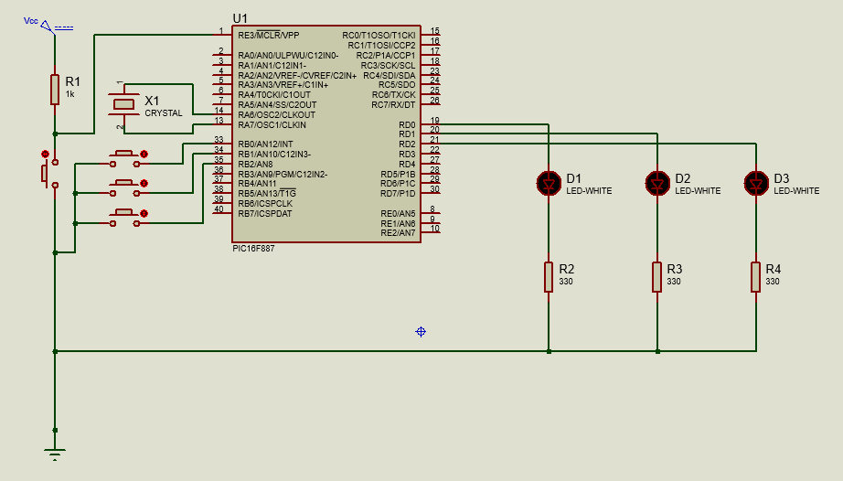
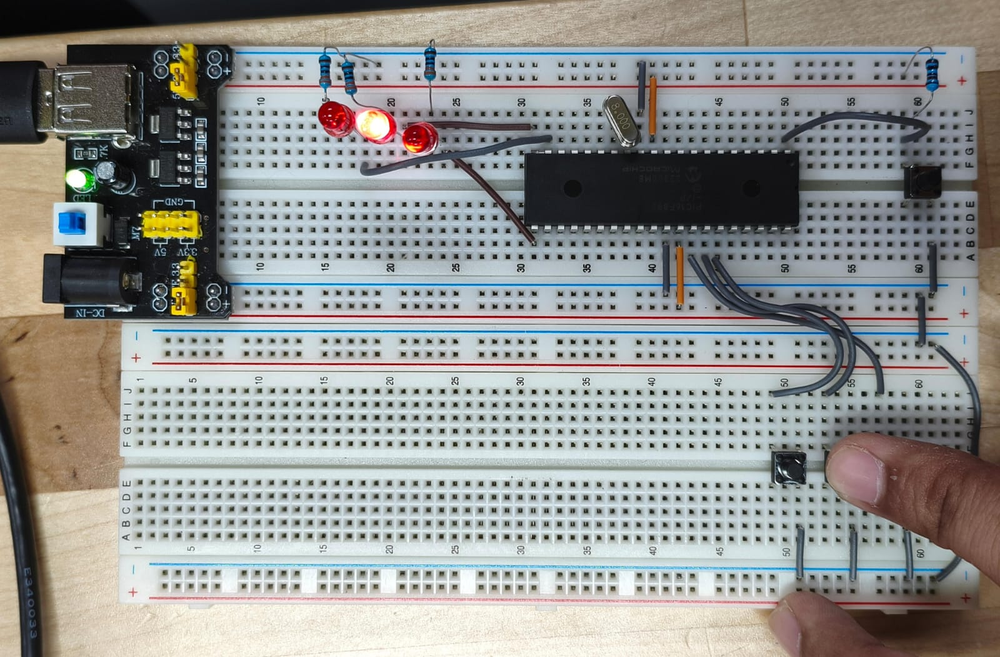

# Practica 4 - Entradas como señal de inputs
Implementación de contador decimal y control de LEDs mediante el manejo de inputs con botones push con el microcontrolador PIC16F887.

 **Esquematico:**  

---
## Actividades
### Clase - Control de LEDs mediante entradas push button.
Programa que implementa un control sobre los LEDs que se encienden en base al boton push que se oprima. Cada botón conectado a RB0–RB2 enciende su LED correspondiente en RD0–RD2 de forma directa.
 - ANSEL y ANSELH Deshabilita las entradas analógicas, por lo que todos los pines son digitales.
 - TRISB define los puertos B como inputs y TRISD define a los puetos D como salidas (LEDs).
 - "OPTION_REG = OPTION_REG & 0b01111111;" Esta línea pone en 0 el bit 7 del registro OPTION_REG, sin modificar los demás bits. Esto nos permite activar las resistencias pull-up internas del Puerto B, lo cual es necesario porque los botones conectados a RB0–RB2 usan lógica negativa.
  **Codigo:**   [Entradas.c](./Entradas.c)

  **Circuito:**  

---
### Actividad 1 - Contador de 00 a 99 con control por 3 botones push-button.
El programa nos permite desarrollar un contador de dos digitos de 00 a 99 con 3 botones: sumar, restar y reset, mostrado sobre 2 displays de 7 segmentos.
 - b
 - 
  **Codigo:**   [Contador Hexadecimal.c](./Contador_0-F.c)

---
## Observaciones
- El operador ! invierte la señal, esto porque los botones usan pull-up por la logica de señales en los inputs del microcontrolador.
- 
- Se implemento un arreglo de tipo const unsigned char de 16 elementos para almacenar los codigos hexadecimales equivalentes a los caracteres del 0 al F.
- Se implemento una condición de reinicio que actúa como límite para el indice al superar el valor númerico de la F.
- Se utilizo la funcion __delay_ms() para controlar los tiempos de cada secuencia.
- 0x00 = 0x00000000 = 0
- Se toma la entrada a del display de 7 segmentos como el bit menos significativo (LSB)
