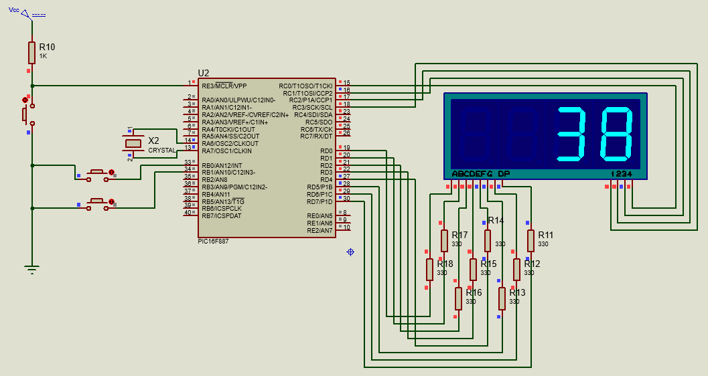
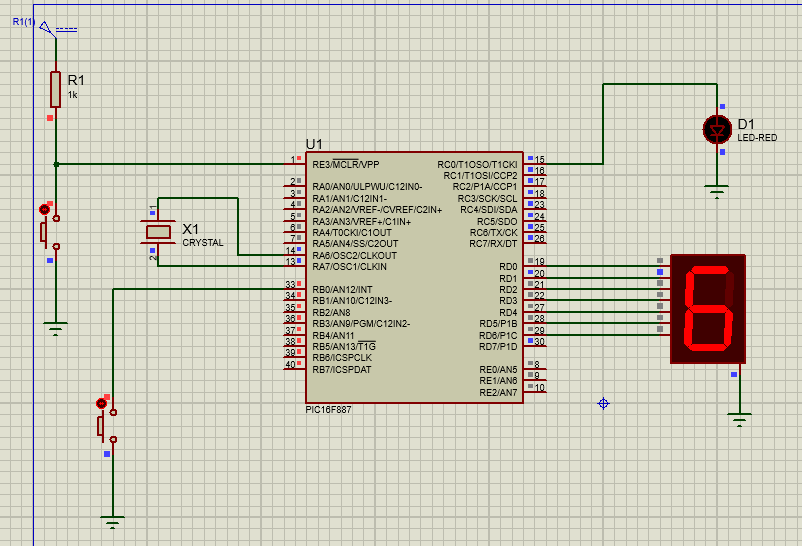
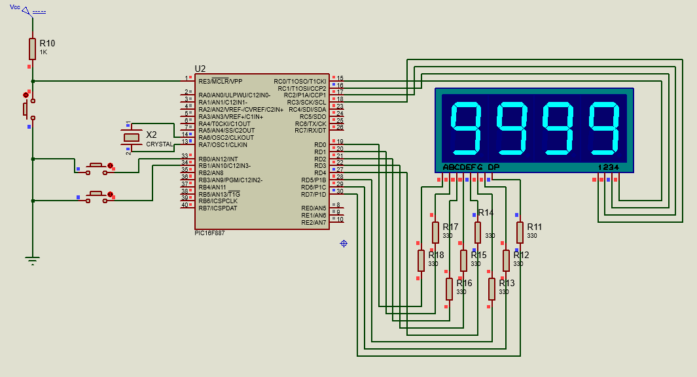
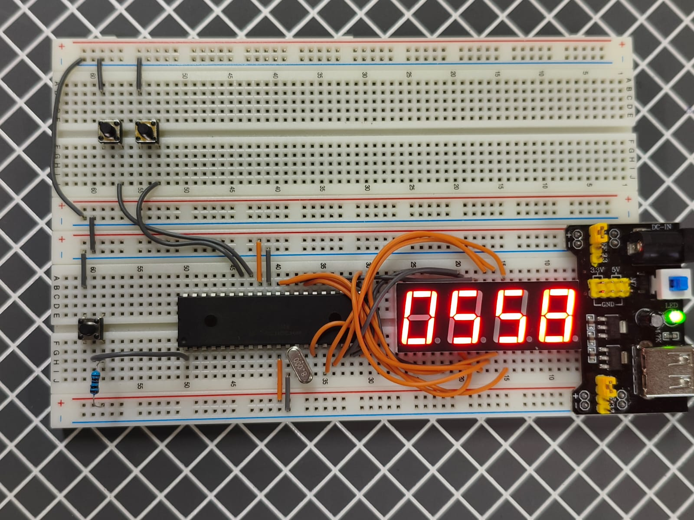

# Practica 5 - Multiplexación e Interrupciones
Implementación de contadores con displays de 7 segmentos usando multiplexación y manejo de interrupciones externas con el microcontrolador PIC16F887.
 
---
## Actividades
### Clase A - Contador automático 00-99 con multiplexación.
Programa que implementa un contador automático de dos dígitos que incrementa solo, usando multiplexación para controlar un displays de 7 segmentos de cuatro digitos.
 - TRISC y TRISD se configuran como salidas: PORTC controla cuál display está activo en cada momento y PORTD envía el patrón de segmentos a mostrar.
 - La variable "num" va incrementando automáticamente de 0 a 99 y regresa a 0 al llegar a 100 con "if(num==100) num = 0;".
 - "dec = num / 10" y "uni = num % 10" separan los dos dígitos para poder mostrarlos por separado en cada display.
 - La multiplexación funciona alternando rápidamente qué digito está encendido: "PORTC = 0b11111101" activa el display de decenas, se envía su patrón, se espera 1 ms, luego "PORTC = 0b11111110" activa el display de unidades y se envía su patrón. Esto se repite 500 veces antes de avanzar el contador, creando la ilusión de que ambos displays están encendidos al mismo tiempo.

  **Codigo:**   [Contador_99.c](./Contador_99.c)

  **Esquematico:**  

---
### Clase B - Interrupción externa con parpadeo de LED.
Programa que muestra un contador de un solo dígito (0-9) en un display de 7 segmentos y, al detectar una interrupción externa en RB0, pausa el conteo y ejecuta un parpadeo de 4 veces en un LED conectado a RC0.
 - "GIE = 1" activa el sistema global de interrupciones, "INTE = 1" habilita específicamente la interrupción externa por RB0 e "INTEDG = 0" la configura para dispararse en flanco de bajada (cuando el botón se presiona y conecta con tierra).
 - El ciclo principal simplemente avanza el display con "count = (count + 1) % 10" cada 500 ms de forma continua.
 - Al presionar el botón, el PIC interrumpe el ciclo principal y ejecuta la función "ISR". Dentro de ella, "GIE = 0" desactiva interrupciones temporalmente para que no se interrumpa la propia interrupción, se inicia la funcion "blink_led()" que parpadea el LED 4 veces, y al terminar "GIE = 1" reactiva las interrupciones y "INTF = 0" limpia la bandera para no repetir la ISR indefinidamente.
 - La función "blink_led()" enciende y apaga RC0 cuatro veces con retardos de 500 ms cada fase.

  **Codigo:**   [Interrupciones.c](./Interrupciones.c)

  **Esquematico:**  

---
### Actividad - Contador 0000-9999 con multiplexación, pausa e inversión por interrupción.
Programa que implementa un contador de cuatro dígitos de 0000 a 9999 con un display de cuatro digitos multiplexados, un botón de pausa (RB1) y una interrupción externa (RB0) que invierte la dirección del conteo.
 - La separación de cuatro dígitos se hace con divisiones y módulos sucesivos: "mil = num / 1000", "cen = (num / 100) % 10", "dec = (num / 10) % 10" y "uni = num % 10".
 - La multiplexación ahora maneja 4 digitos, activando uno a la vez con PORTC usando palabras binarias distintas (0b11110111, 0b11111011, 0b11111101, 0b11111110) y enviando el patrón correspondiente por PORTD, con 1 ms de delay entre cada uno. Este ciclo se repite 10 veces antes de avanzar el contador.
 - La variable "pausado" se alterna con el botón RB1 usando "pausado = !pausado". Cuando está activa, el contador deja de avanzar pero los displays siguen encendiendo sus LEDs normalmente, por lo que el número se mantiene visible y estático.
 - La variable "direccion" controla si el contador sube (1) o baja (0). El ciclo principal la revisa en cada iteración para decidir si hace "num++" o "num--", con límites circulares: al llegar a 10000 regresa a 0, y al bajar de 0 salta a 9999.
 - La interrupción externa en RB0 (flanco de bajada) ejecuta la ISR, que únicamente hace "direccion = !direccion" para invertir el sentido del conteo de forma inmediata, sin detenerlo.

  **Codigo:**   [Contador_9999_Interrupciones.c](./Contador_9999_Interrupciones.c)

  **Esquematico:**  

  **Circuito:**  

---
## Observaciones
- Las interrupciones permiten que el microcontrolador reaccione a eventos externos sin necesidad de estar revisando constantemente el estado de los pines, lo que hace el código más eficiente y organizado.
- El antirrebote sigue siendo necesario incluso con interrupciones, ya que el rebote mecánico del botón puede disparar múltiples interrupciones por una sola pulsación.
- Para contadores de más de dos dígitos es necesario cambiar el tipo de dato de "unsigned char" a "int", ya que "unsigned char" solo soporta valores hasta 255. Es por esta razón que la variable "num" se establece usando int.
- "int num" se establece sin "unsigned int" ya que si fuera "unsigned int", la variable "num" nunca podría ser menor a 0. Cuando la interpretación de la variable usa "unsigned" que llega a 0 y le restas 1, no da -1, sino que hace un desbordamiento y salta directo a 65535 (el valor máximo de 16 bits sin signo). Entonces la condición "if(num < 0) num = 9999;" jamás se cumpliría y el límite inferior nunca funcionaría. Esto es porque "unsigned" reprenta una interpretacion del tipo de dato char/int como magnitud, todos los bits representan magnitud, no existe negativo. Sin "unsigned" el bit más significativo se usa para indicar si el número es positivo o negativo. Le "cedes" un bit de la palabra binaria al signo. 
