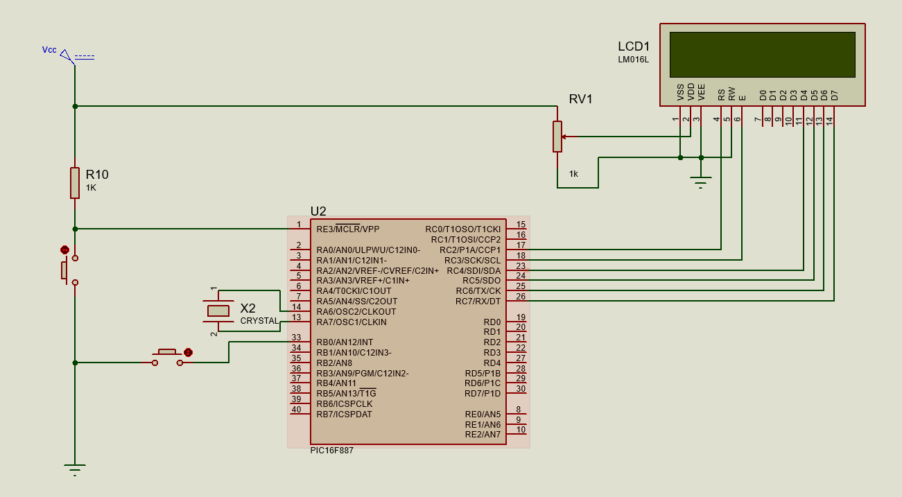
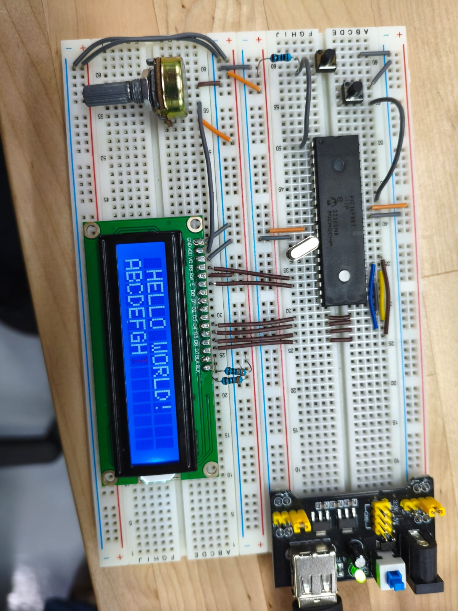
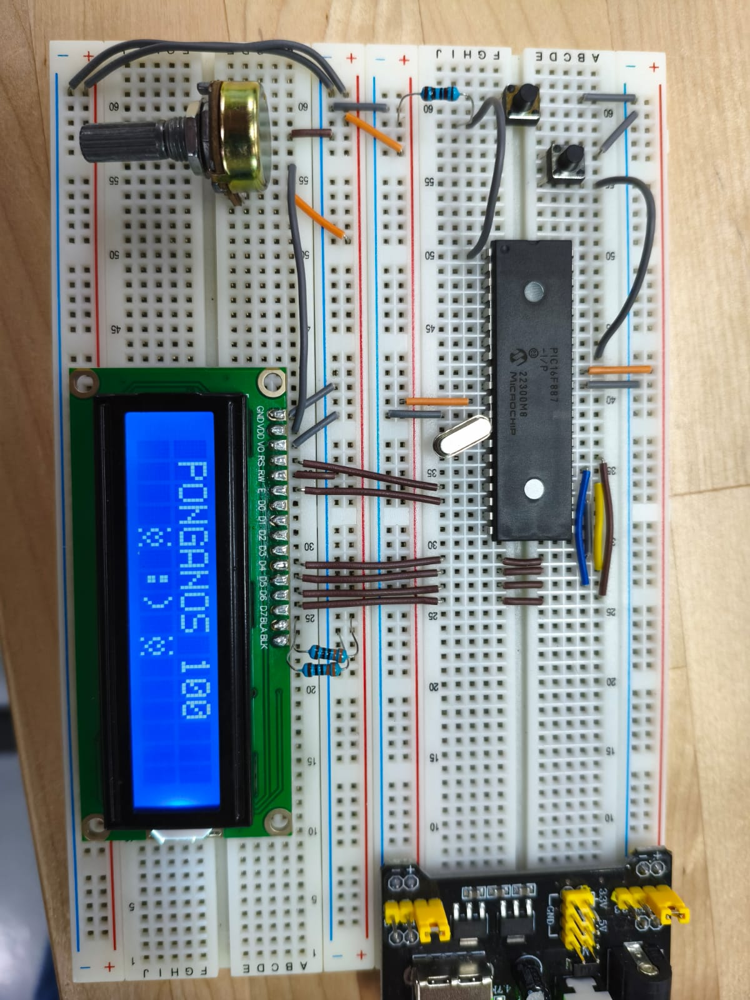

# Practica 6 - Display LCD 16x2
Implementación del uso de un display LCD 16x2 con el microcontrolador PIC16F887 usando una librería de funciones personalizada, desde mostrar texto básico hasta crear caracteres personalizados en la CGRAM y controlar animaciones mediante interrupciones externas.

---
## Actividades
### Clase - Hello World en display LCD.
Programa que inicializa un display LCD 16x2 y muestra el mensaje "HELLO WORLD!" en la primera fila mientras anima una secuencia de letras de la A a la P en la segunda fila, repitiendo el ciclo indefinidamente.
 - "LCD lcd = {&PORTC, 2, 3, 4, 5, 6, 7}" define la conexión del LCD usando una estructura que guarda el puerto y los pines específicos de RS, EN, D4, D5, D6 y D7. Esto permite que la librería sea reutilizable en cualquier puerto sin modificar lcd.c.
 - "LCD_Init(lcd)" configura automáticamente el TRISC como salida, envía la secuencia de reset del LCD y lo inicializa en modo de 4 bits, que usa la mitad de pines que el modo de 8 bits sin perder funcionalidad.
 - "LCD_putrs()" imprime cadenas de texto almacenadas en la memoria de programa y recibe punteros a "const char". "LCD_putc()" imprime un solo carácter. Ambas recorren el LCD carácter por carácter usando "LCD_Set_Cursor" para posicionar el cursor antes de cada escritura.
 - "LCD_Set_Cursor(fila, columna)" posiciona el cursor enviando un comando a la DDRAM del LCD. La fila 0 corresponde al comando "0x80 + columna" y la fila 1 a "0xC0 + columna", que son las direcciones de memoria interna del LCD para cada línea.
 - "LCD_Clear()" envía el comando "0x01" al LCD que borra todo el contenido visible y regresa el cursor a la posición (0,0). Se llama al inicio de cada ciclo del while para evitar que caracteres anteriores queden visibles detrás del nuevo mensaje.

  **Codigo:**   [Display_LCD.c](./Display_LCD.c)

  **Esquematico:**  

  **Circuito:**  

---
### Actividad 1 - Carácter personalizado y animación por interrupción.
Programa que muestra el mensaje "HELLO WORLD!" con la animación de letras de la clase, pero al presionar un botón en RB0 interrumpe la animación y muestra el mensaje "PONGANOS 100" acompañado de un carácter personalizado de corazón hueco guardado en la CGRAM del LCD, repitiéndolo 3 veces antes de regresar automáticamente al Hello World.
 - "LCD_CreateChar(pos, patron_char)" escribe un carácter personalizado en la CGRAM del LCD enviando primero el comando "0x40 | (pos << 3)" para apuntar a la posición correcta, luego las 8 filas del patrón de píxeles, y finalmente "0x80" para regresar el cursor a la DDRAM. Sin este último comando los siguientes "LCD_putc()" escribirían en la CGRAM en lugar de en pantalla.
 - El carácter personalizado se define como un arreglo de 8 bytes donde cada byte representa una fila de 5 píxeles. Solo los 5 bits menos significativos de cada byte se usan ya que la pantalla tiene 5 columnas. Para imprimirlo basta con "LCD_putc(0)" ya que fue guardado en la posición 0 de la CGRAM.
 - "LCD_CreateChar" se agrega a "lcd.h" como declaración y se implementa directamente en "main.c" ya que usa "LCD_Cmd" y "LCD_putc" que son funciones de la librería. Esto extiende la librería sin modificar "lcd.c".
 - "interrupcion_activa" se declara "volatile unsigned char" porque la ISR la modifica en cualquier momento fuera del flujo normal del while. La ISR solo la pone en 1 y el main se encarga de todo el trabajo, siguiendo el principio de mantener la ISR lo más corta posible.
 - El mensaje de interrupción se muestra 3 veces con un ciclo "for(rep < 3)" con un parpadeo breve entre repeticiones usando "LCD_Clear()" y un delay de 300ms. Al terminar el main regresa "interrupcion_activa = 0" sin necesidad de presionar el botón de nuevo.
 - Si el botón se presiona durante la animación de letras, el "if(interrupcion_activa == 1) break" dentro del for interrumpe la secuencia inmediatamente para responder al botón sin esperar que termine el ciclo completo.

  **Codigo:**   [LCD_caracter_especial.c](./LCD_caracter_especial.c)

  **Esquematico:**  

  **Circuito:**  

[▶ Ver video del circuito](./LCD_caracter_especial.mp4)

---
## Observaciones
- El LCD 16x2 se comunica en modo de 4 bits usando solo D4-D7, enviando cada byte en dos nibbles de 4 bits cada uno. Esto reduce a 6 los pines necesarios del PIC (RS, EN, D4, D5, D6, D7) en lugar de los 10 del modo de 8 bits.
- La CGRAM del LCD permite guardar hasta 8 caracteres personalizados en las posiciones 0-7. La posición 0 equivale al carácter nulo "\0" en C, por lo que las funciones de texto como "LCD_putrs()" terminan al encontrarlo. Para evitar este conflicto en cadenas de texto, los caracteres personalizados deben imprimirse siempre con "LCD_putc(pos)" y no incrustarse en cadenas.
- "LCD_putrs()" recibe "const char*" para cadenas en memoria de programa, mientras que "LCD_puts()" recibe "char*" para cadenas en RAM. En XC8 para PIC usar el tipo incorrecto puede causar que la cadena se lea desde una dirección incorrecta y muestre caracteres basura en el LCD.
- Cada vez que se escribe en CGRAM el cursor apunta a esa memoria. Si no se regresa a DDRAM con "LCD_Cmd(0x80)" al terminar "LCD_CreateChar", los siguientes intentos de escribir texto en pantalla fallarán silenciosamente porque el cursor sigue apuntando a la CGRAM.
