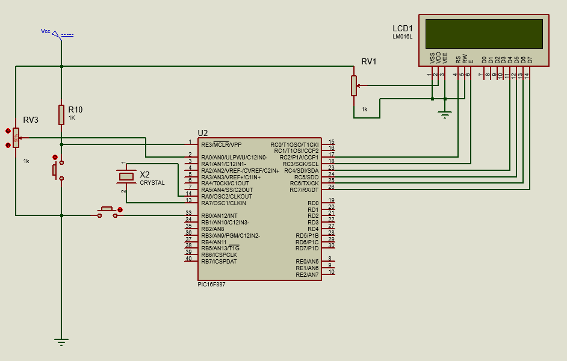
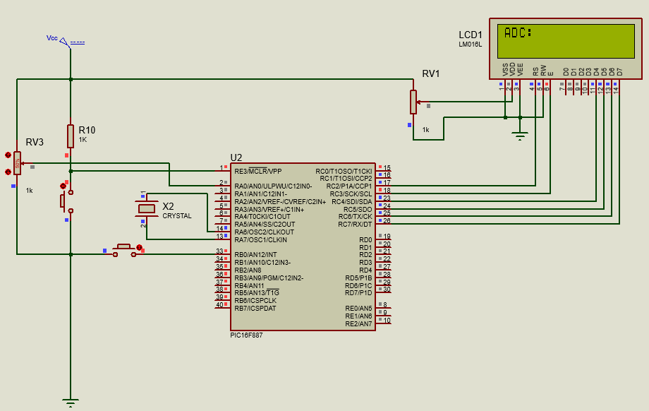
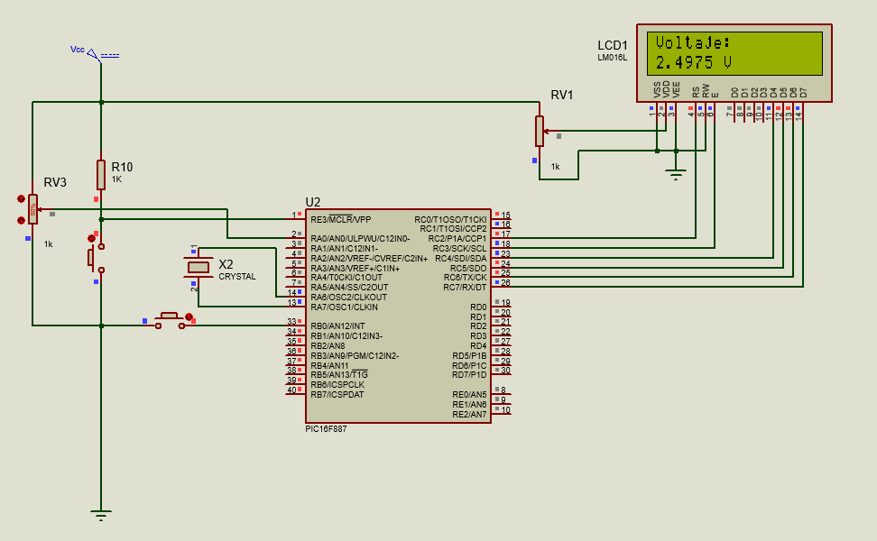
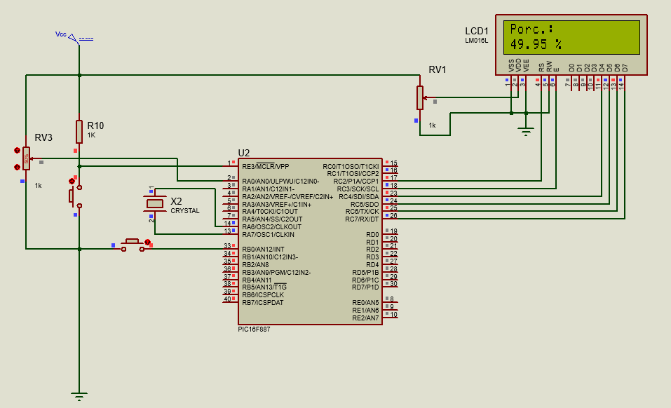
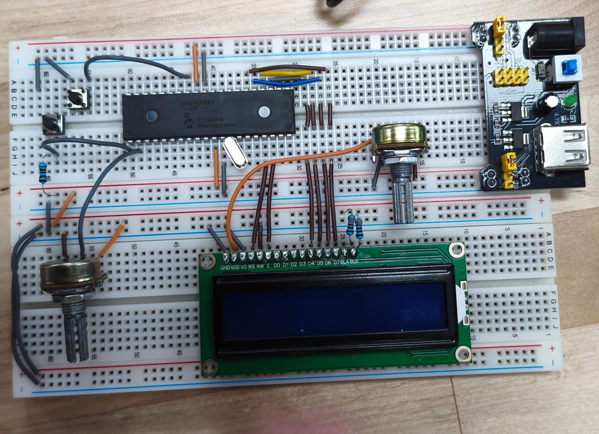

# Practica 7 - Conversión Analógica a Digital / Procesamiento de lecturas ADC
Implementación de un lector de voltaje analógico con visualización en LCD de 2x16, usando el módulo ADC del PIC16F887 y cambio de modo de visualización mediante interrupción externa.
 
---
## Actividades
### Reto - Lectura ADC con tres modos de visualización alternados por interrupción
Programa que lee una señal analógica en el pin RA0 y la muestra en un LCD en tres modos distintos: voltaje, porcentaje y valor ADC crudo. Un botón en RB0 cambia de modo mediante interrupción externa.
 - ANSEL = 0x01 configura únicamente RA0 como entrada analógica, el resto de los pines del puerto quedan como digitales.
 - ADCON0 = 0x81 selecciona el canal AN0.
 - ADCON1 = 0x80 configura el resultado en formato justificado derecho dejando los 2 bits más significativo en ADRESH y los restantes en ADRESL.
 - ADC_Read() espera 5 us para que el capacitor interno se cargue, activa la conversion con GO_nDONE = 1 y espera a que el hardware la complete. El resultado de 10 bits se reconstruye con (ADRESH << 8) + ADRESL, produciendo un valor de 0 a 1023.
 - Se evita el uso de float en todos los cálculos. En el Modo Voltaje se multiplica la lectura ADC por 50,000 y se divide entre 1023, obteniendo el voltaje en decenas de microvolt como entero, luego se separa en parte entera y decimal con /10,000 y %10,000. En el Modo Porcentaje, se multiplica por 10,000 y se divide entre 1023 para conservar dos decimales; la parte entera se obtiene con /100 y la decimal con %100. El modo 2 muestra directamente el valor crudo de 10 bits sin conversión.
 - La variable global modo controla cuál de los tres modos esta activo. El ciclo principal la consulta en cada iteración para decidir qué calcular y mostrar.
 - ANSELH = 0 y OPTION_REG & 0b01111111 configuran PORTB como digital y activan los pull-ups internos, evitando que RB0 flote y genere interrupciones falsas.

  **Codigo:**   [Conversion_ADC.c](./Conversion_ADC.c)

  **Esquematico:**  

  **Modo ADC:**  

  **Modo Voltaje:**  

  **Modo Porcentaje (%):**  

  **Circuito:**  

---
## Observaciones
- Trabajar con enteros en lugar de float es una práctica recomendada en microcontroladores de 8 bits, ya que las operaciones de punto flotante consumen mucha más memoria. Multiplicar primero por un factor grande antes de dividir permite conservar decimales necesarios sin perder precisión por truncamiento.
- 
