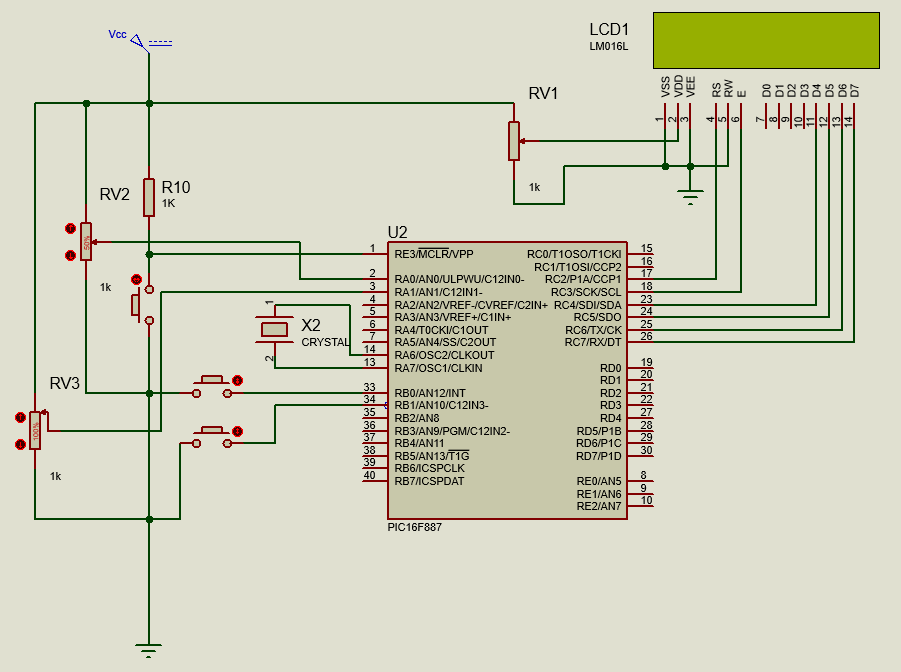
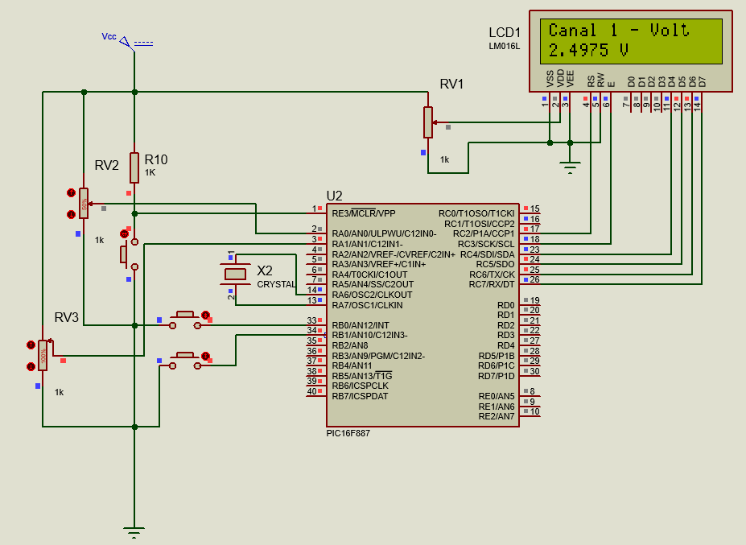
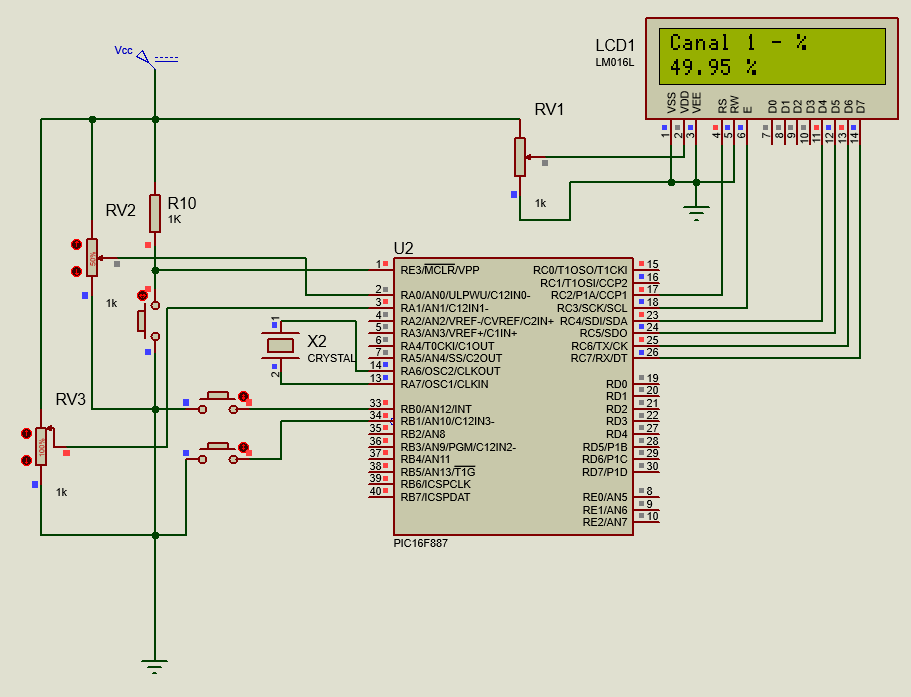
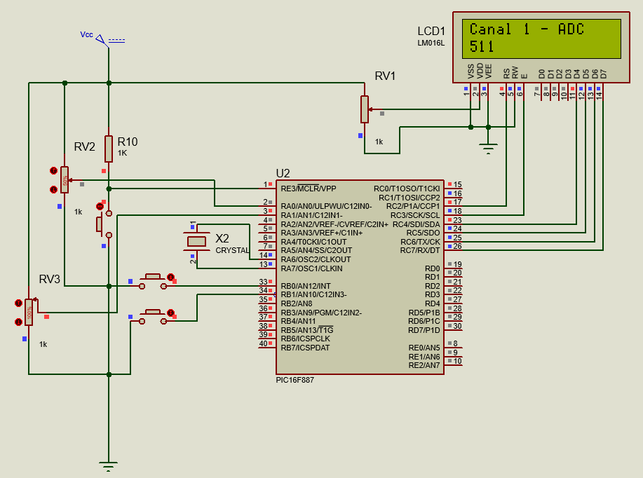
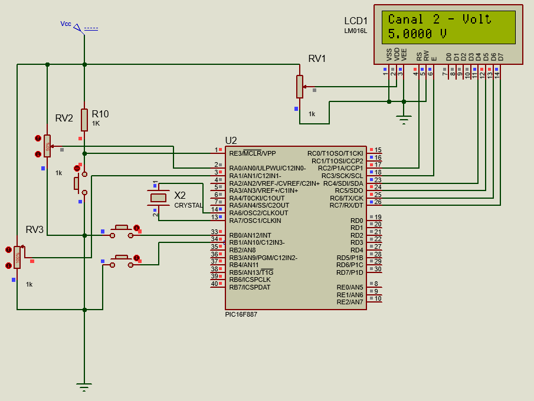
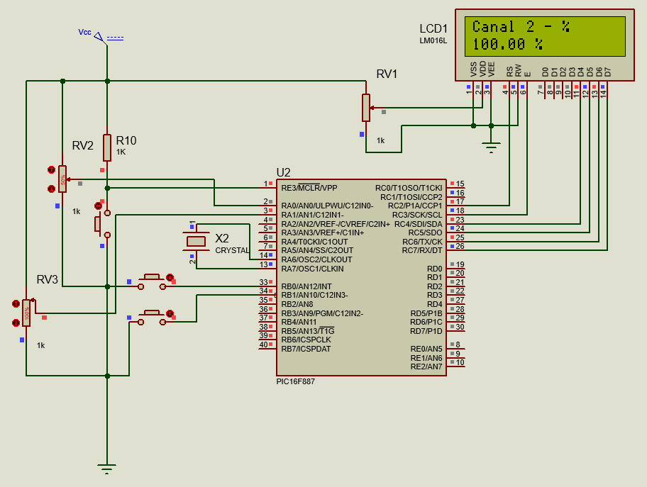
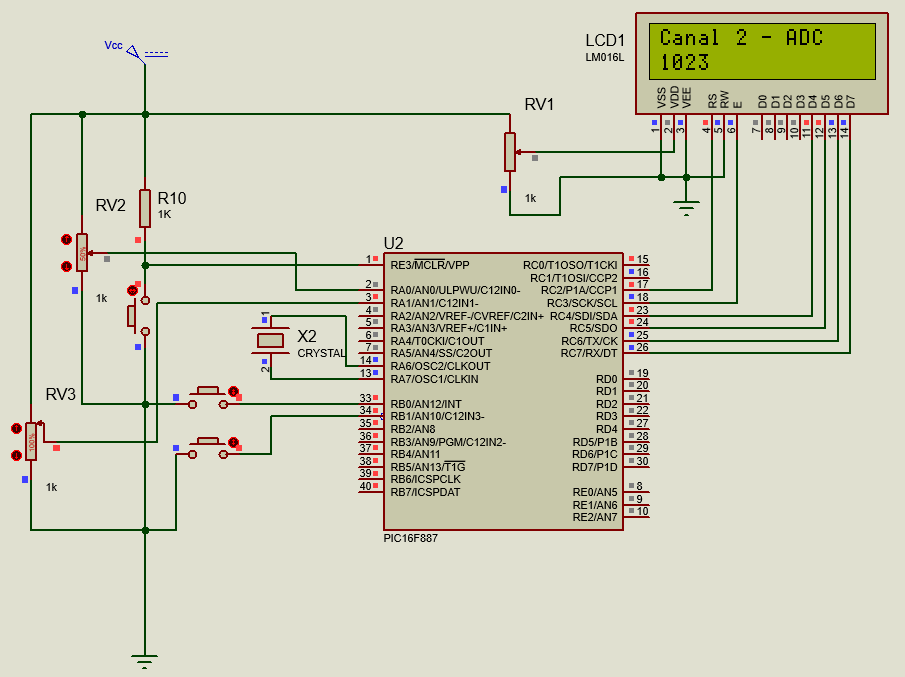

# Practica 8 - Lectura ADC Multi-Canal con LCD

Implementación de lectura analógica en múltiples canales con visualización en LCD de 2x16, usando el módulo ADC del PIC16F887 con selección de canal e interrupción externa.

---

## Esquematico

---

## Actividades

### Clase - Lectura simultánea de dos canales ADC en voltaje

Programa que lee dos señales analógicas en RA0 y RA1 y muestra el voltaje de ambos canales al mismo tiempo en las dos líneas del LCD.

- `ANSEL = 0x03` habilita RA0 y RA1 como entradas analógicas (bits 0 y 1 en 1). El resto de pines quedan como digitales.
- `ADC_Read(channel)` recibe el número de canal como parámetro. Antes de cada lectura limpia los bits de selección de canal con `ADCON0 &= 0x83` y coloca el canal deseado con `ADCON0 |= channel << 2`, permitiendo alternar entre AN0 y AN1 en la misma función.
- El voltaje se calcula multiplicando el resultado ADC por 50,000 y dividiendo entre 1023 para evitar el uso de `float`. La parte entera se obtiene con `/10000` y la decimal con `%10000`.
- Ambos voltajes se muestran en simultáneo: línea 0 para el Canal 1 y línea 1 para el Canal 2, con un refresco de 100 ms.

  **Codigo:**   [Display_ADC_Voltajes.c](./Display_ADC_Voltajes.c)

  **Display:**  

---

### Reto - Dos canales ADC con tres modos de visualización, canal por interrupción y modo por interrupción externa

Programa que lee dos canales analógicos (RA0 y RA1) y los muestra en tres modos distintos: voltaje, porcentaje y valor ADC crudo. El botón en RB0 cambia de canal mediante interrupción externa y el botón en RB1 cambia de modo mediante polling.

- `ADC_Read(channel)` selecciona el canal activo en cada llamada limpiando los bits de selección con `ADCON0 &= 0x83` y escribiendo el nuevo canal con `ADCON0 |= channel << 2` seguido de un retardo de 2 ms para que el capacitor de muestreo se estabilice antes de iniciar la conversión.
- Las variables globales `canal` y `modo` se declaran `volatile` porque la ISR puede modificar `canal` en cualquier momento fuera del flujo del ciclo principal.
- El cambio de modo con RB1 se maneja por polling: se detecta flanco de bajada, se aplica antirrebote de 30 ms, se confirma que el botón sigue presionado y se espera a que se suelte antes de continuar, evitando múltiples avances por una sola pulsación.
- La ISR en RB0 alterna `canal` de forma circular con `(canal + 1) % 2` y el ciclo principal alterna `modo` con `(modo + 1) % 3`, manteniendo ambas variables siempre en rango válido.
- La línea 0 del LCD muestra el canal activo y el modo actual (`Canal 1 - Volt`, `Canal 2 - %`, etc.) y la línea 1 muestra el valor calculado, actualizándose cada 200 ms.

  **Codigo:**   [Display_ADC_Interrupcion_Modos_Canales.c](./Display_ADC_Interrupcion_Modos_Canales.c)

  **Modos de visualización:**  

 &nbsp;&nbsp;
 &nbsp;&nbsp;

 &nbsp;&nbsp;
 &nbsp;&nbsp;

---

  **Circuito:**  

---

## Observaciones

- La función `ADC_Read` con parámetro de canal elimina la necesidad de tener una función distinta por canal. Limpiar los bits con `&= 0x83` antes de escribir el nuevo canal evita que bits anteriores interfieran con la selección.
- El retardo de 2 ms después de cambiar de canal (`__delay_ms(2)`) es necesario para que el capacitor interno de muestreo se descargue del canal anterior y se cargue con la nueva señal antes de iniciar la conversión.
- Combinar interrupción (RB0 para canal) con polling (RB1 para modo) es una estrategia válida cuando un evento requiere respuesta inmediata y el otro puede revisarse en cada iteración del ciclo principal sin perder funcionalidad.
- Usar `unsigned long` en los cálculos intermedios de voltaje y porcentaje evita desbordamiento al multiplicar valores ADC de hasta 1023 por factores de 50,000 o 10,000, que superan el límite de `unsigned int` (65,535).
