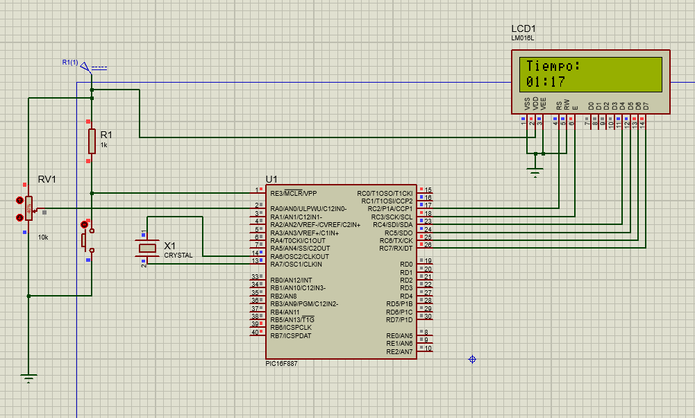
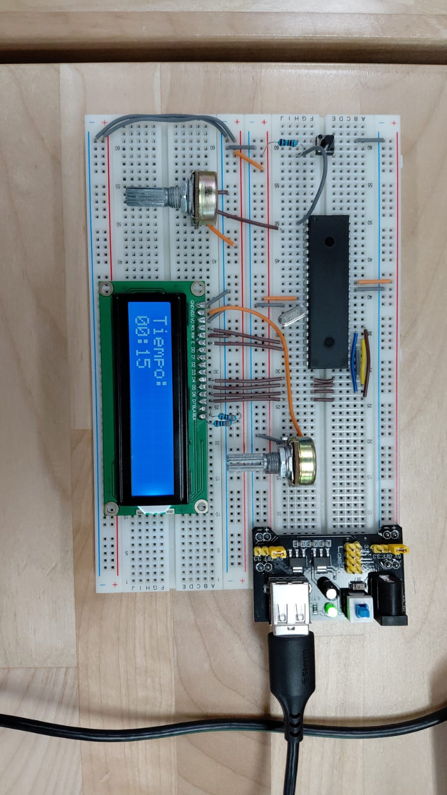

# Practica 9 - Timers e Interrupciones con LCD
Implementación de un temporizador usando Timer 0 con interrupciones y visualización en display LCD, junto con la lectura de voltaje por ADC con temporizador de actividad usando el microcontrolador PIC16F887.
 
---
## Actividades
### Clase - Temporizador con Timer 0 en LCD.
Programa que implementa un cronómetro de tiempo en formato MM:SS mostrado en un display LCD usando el Timer 0 del PIC16F887 con interrupciones, sin usar delays en el ciclo principal para no bloquear el conteo.
 - "OPTION_REG = 0x07" configura el Timer 0 con un prescaler de 1:256. Este registro también controla las resistencias pull-up internas del Puerto B y el flanco de la interrupción externa, por lo que su configuración afecta más de un periférico a la vez.
 - "TMR0 = 178" carga el valor inicial calculado con el script de MATLAB para generar una interrupción cada 10 ms con Fosc de 8MHz y prescaler 1:256. Este valor debe recargarse manualmente en cada interrupción porque el timer se resetea a 0 al desbordarse.
 - "TMR0IE = 1" habilita la interrupción específica del Timer 0 y "GIE = 1" habilita el sistema global de interrupciones. A diferencia del Timer 1 y Timer 2, Timer 0 es una interrupción directa que no requiere "PEIE = 1".
 - La ISR incrementa "contador" en cada interrupción de 10 ms. Al llegar a 100 (equivalente a 1 segundo) incrementa "tiempo" y resetea el contador. "T0IF" es la bandera del Timer 0 y debe limpiarse manualmente con "TMR0IF = 0" al final de la ISR para no repetirla indefinidamente.
 - Las variables "tiempo" y "contador" se declaran "volatile" porque la ISR las modifica en cualquier momento fuera del flujo normal del programa. Sin "volatile" el compilador podría optimizarlas incorrectamente.
 - "sprintf(exec,"%02u:%02u", tiempo/60, tiempo%60)" convierte los segundos totales en formato MM:SS usando división y módulo, el mismo patrón que hemos usado para separar dígitos en prácticas anteriores. El buffer "exec" es de 6 caracteres: 2 dígitos + ':' + 2 dígitos + '\0'.
 - El ciclo principal no usa delays, solo actualiza el LCD constantemente. El Timer 0 corre de forma independiente en hardware y la ISR se encarga del conteo sin interferir con el refresco del display.

  **Codigo:**   [Timer0_clase.c](./Timer0_clase.c)
 
  **Esquematico:**  

 
  **Circuito:**  

 
---
### Actividad - Voltaje en tiempo real con cronómetro usando Timer 0.
 
<!-- PENDIENTE: agregar descripcion de la actividad -->
 
  **Codigo:**   [main.c](./main.c)
 
  **Esquematico:**  

 
  **Circuito:**  

 
---
## Observaciones
- Timer 0 es una interrupción directa que solo necesita "GIE = 1" para funcionar. Timer 1 y Timer 2 son interrupciones periféricas que además requieren "PEIE = 1", de lo contrario la ISR nunca se dispara aunque el timer esté corriendo.
- El valor inicial del Timer 0 (TMR0 = 178) debe recargarse manualmente en cada ISR porque el timer se resetea a 0 al desbordarse. Timer 2 no tiene este problema porque cuenta hasta PR2 y se resetea solo sin intervención del código.
- El Timer 0 es de 8 bits (0-255) por lo que para lograr intervalos de 1 segundo se necesita un contador auxiliar de 100 interrupciones de 10 ms cada una. Timer 1 de 16 bits permite intervalos más largos con mayor precisión sin necesitar un contador auxiliar tan grande.
- No usar delays en el ciclo principal es fundamental cuando se trabaja con timers e interrupciones, ya que un "__delay_ms()" bloquearía el procesador e impediría que el LCD se actualice fluidamente, aunque el timer seguiría corriendo en hardware.
 
