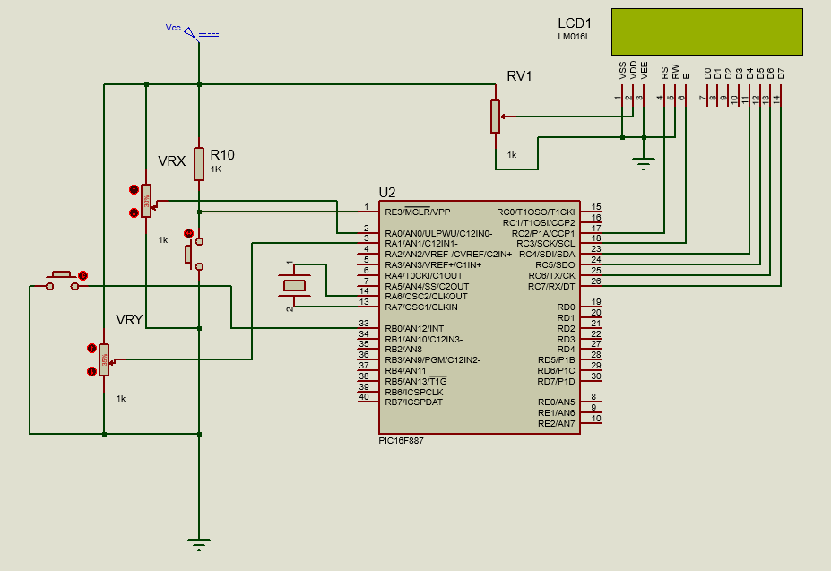
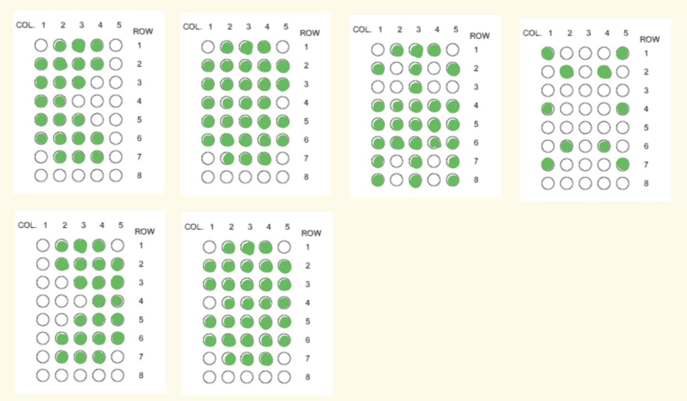
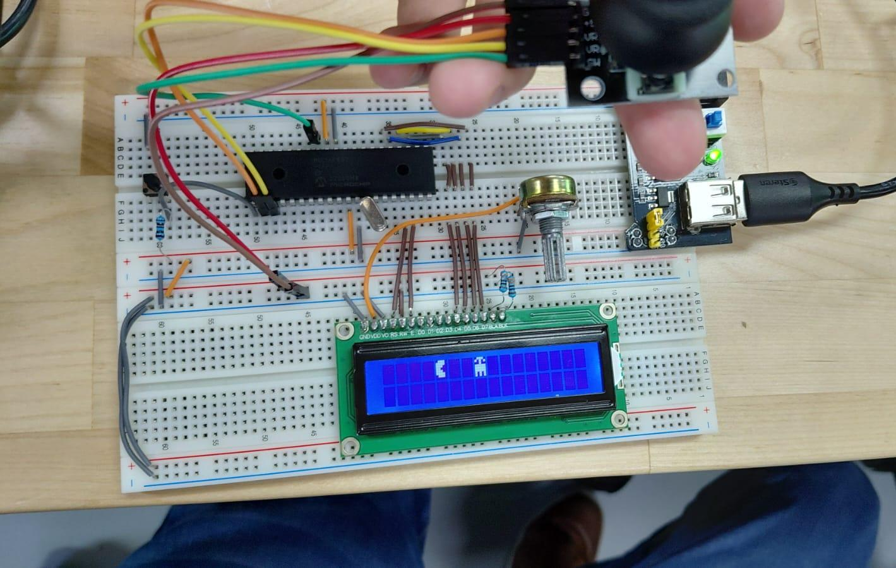
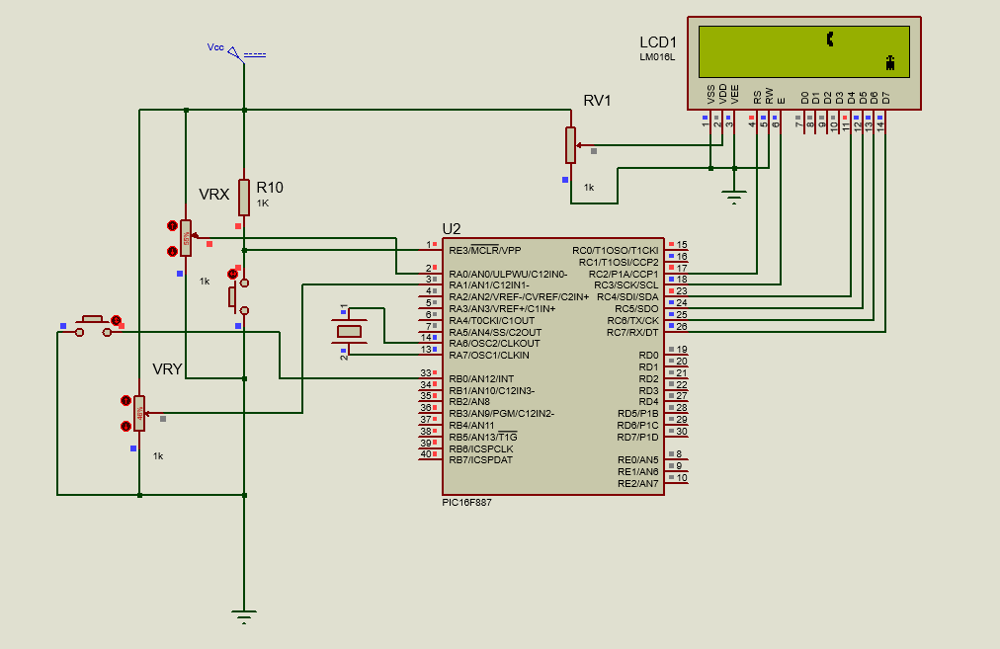
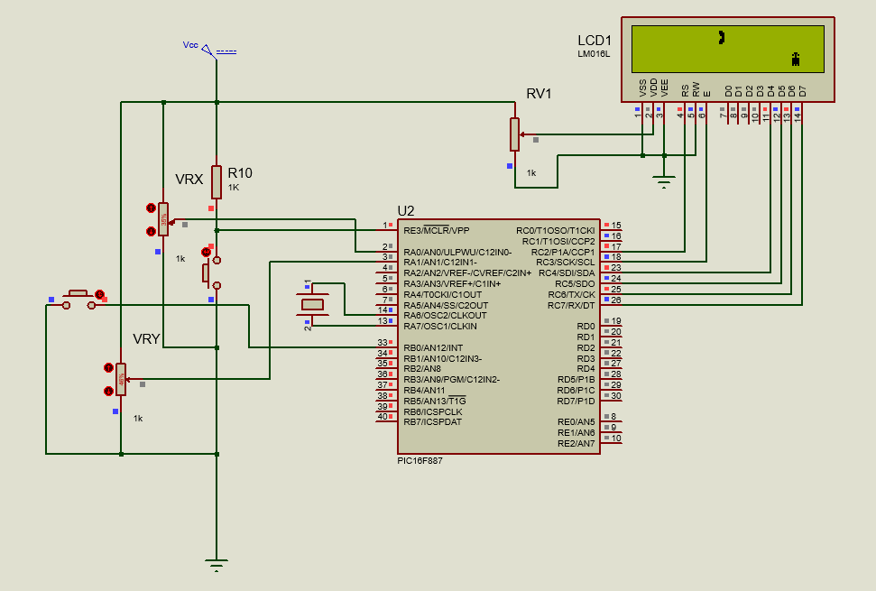
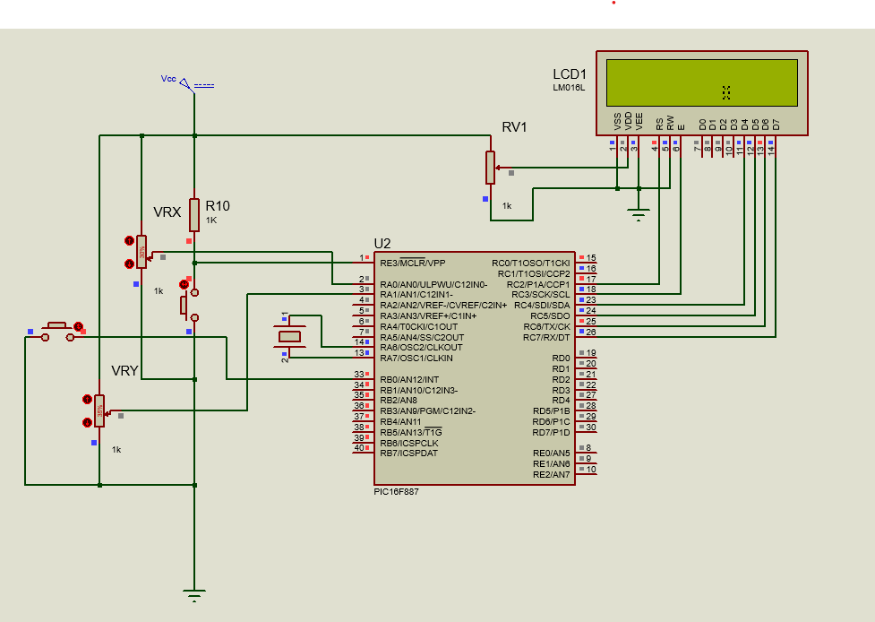
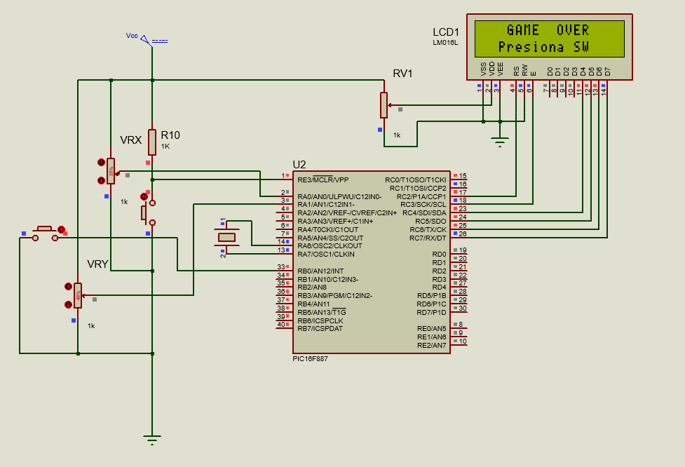

# Proyecto 1 - Videojuego Pacman/Fantasma en LCD con Joystick
Implementación de un videojuego tipo Pacman controlado por joystick, donde un personaje se desplaza sobre las 32 celdas de un display LCD 16x2 (usando caracteres personalizados) evadiendo a un fantasma que aparece en posición aleatoria, usando el microcontrolador PIC16F887.

---
## Descripción general
El jugador controla un personaje tipo Pacman mediante un joystick analógico de dos ejes:

| Control | Acción |
|---|---|
| Eje X (RVx) | Mueve al personaje horizontalmente; la velocidad es proporcional a la inclinación del joystick |
| Eje Y (RVy) | Cambia al personaje entre la fila 0 y la fila 1 del LCD |
| Botón (SW) | Activa la animación de "boca cerrada" mientras se mantiene presionado |

Al llegar a la columna 0 o a la columna 15, el personaje se teletransporta al extremo opuesto. Si el personaje coincide en posición con el fantasma, se dispara una secuencia de colisión, una pantalla de "GAME OVER" y el juego espera que el usuario presione el botón para reiniciar.

---
## Características del sistema
 - 6 caracteres personalizados creados con "LCD_CreateChar()" sobre patrones de matriz 5x8: Pacman normal (derecha e izquierda), Pacman boca cerrada (derecha e izquierda), fantasma y explosión, permitiendo representar dirección y animación sin más de un carácter por celda.
 - Doble lectura ADC en cada vuelta del "while(1)": "ADC_Read(0)" para el eje X del joystick (RVx) y "ADC_Read(1)" para el eje Y (RVy), reconfigurando el canal en cada llamada mediante "ADCON0 &= 0x83" seguido de "ADCON0 |= channel << 2".
 - El eje Y se interpreta con dos umbrales simétricos alrededor del centro (512): valores por encima de "512 + UMBRAL_Y" mueven al personaje a la fila 0 y por debajo de "512 - UMBRAL_Y" a la fila 1, dejando una zona muerta central donde el personaje no cambia de fila.
 - El eje X usa una zona muerta más amplia y asimétrica ("UMBRAL_X_MIN = 462", "UMBRAL_X_MAX = 562") para absorber el ruido natural del potenciómetro del joystick en reposo, evitando que el personaje se mueva solo por inestabilidad de la lectura.
 - La velocidad horizontal es proporcional a la inclinación del joystick: se calcula la diferencia entre la lectura ADC y el umbral correspondiente ("dif = rvx - UMBRAL_X_MAX" o "dif = UMBRAL_X_MIN - rvx"), y si esa diferencia supera 400 se avanzan 2 columnas por ciclo en vez de 1, dando una sensación de aceleración al inclinar más el joystick.
 - El fantasma se posiciona con "generar_fantasma()", que incrementa un acumulador "aleatorio" en pasos de 7 y deriva la columna con "% 16" y la fila con "(aleatorio / 16) % 2"; un "do-while" repite el cálculo si la posición resultante coincide con la del personaje, garantizando que el fantasma nunca aparezca encima de Pacman.
 - El botón SW se lee con resistencias pull-up internas ("OPTION_REG &= 0x7F" y "WPUB0 = 1"), por lo que el botón se considera presionado en estado bajo; mientras se mantiene presionado, "fig_nueva" selecciona el carácter de "boca cerrada" en la dirección actual del movimiento.
 - El teletransporte se evalúa antes de aplicar el movimiento: si "col + vel > 15" (borde derecho) la columna se reinicia a 0, y si "col < vel" (borde izquierdo) se reinicia a 15; en ambos casos se vuelve a generar la posición del fantasma y se limpia el LCD para evitar residuos del fantasma en su posición anterior.
 - La detección de colisión compara "col == f_col && fila == f_fila" antes de redibujar cualquier figura. Al detectarse, se borra a Pacman de su posición previa, se muestra el fantasma fijo en la celda de colisión, después se sustituye por el carácter de explosión, y finalmente se limpia el LCD para mostrar "GAME OVER" y esperar a que el usuario presione SW para reiniciar.
 - El redibujado del LCD ocurre solo cuando algo cambió ("col != col_prev || fila != fila_prev || fig_nueva != figura"), evitando parpadeo innecesario cuando el joystick está en reposo y el botón no se presiona.
 - Si el personaje cambia de fila, se limpia explícitamente el residuo que pudiera quedar en la fila nueva en la misma columna ("LCD_Set_Cursor(fila, col_prev); LCD_putc(' ')"), y si la posición anterior de Pacman coincidía con la del fantasma, este se redibuja para no perderlo de vista tras el movimiento.
 - El ciclo principal usa "__delay_ms(150)" como única pausa, fijando la velocidad de refresco del juego sin bloquear la lectura del ADC ni la detección del botón en cada vuelta.

  **Codigo:**   [Proyecto1.c](./Proyecto1.c)

  **Esquematico:**  

  **Figuras personalizadas:**  

  **Circuito:**  

  **Estados del juego:**  
<table>
<tr>
<td></td>
<td></td>
</tr>
<tr>
<td></td>
<td></td>
</tr>
</table>

---
## Observaciones
- Usar zonas muertas distintas para cada eje del joystick (simétrica en Y, asimétrica en X) refleja que ambos potenciómetros pueden tener un punto de reposo levemente distinto del centro teórico (512), por lo que calibrar cada umbral por separado evita movimiento involuntario del personaje.
- La velocidad variable (1 o 2 columnas por ciclo según la inclinación) es una forma simple de simular control proporcional sin necesidad de un mapeo continuo del ADC a velocidad, similar en espíritu a la calibración por tabla usada en otras prácticas con servomotores.
- Generar la posición del fantasma con un acumulador incremental ("aleatorio += 7") en lugar de una función de números aleatorios real es una solución ligera apropiada para un microcontrolador sin generador de números pseudoaleatorios dedicado, aprovechando que el valor crece de forma distinta en cada partida según cuántos ciclos hayan transcurrido.
- Verificar la colisión antes de redibujar (en vez de después) es lo que permite mostrar correctamente la secuencia de "fantasma visible -> explosión -> GAME OVER", ya que de lo contrario el personaje podría dibujarse encima del fantasma sin que el jugador note la coincidencia de posición.
- Redibujar solo cuando hay cambios reales de estado (posición o figura) es el mismo principio de optimización usado en prácticas anteriores con LCD: evita parpadeo y reduce las veces que se llama a "LCD_Set_Cursor()"/"LCD_putc()" en cada vuelta del ciclo principal.
- El teletransporte limpia toda la pantalla con "LCD_Clear()" en lugar de borrar solo la celda anterior del personaje, ya que al cambiar de extremo también se reubica el fantasma y ambos elementos podrían quedar con residuos visuales si no se reinicia el LCD por completo.
