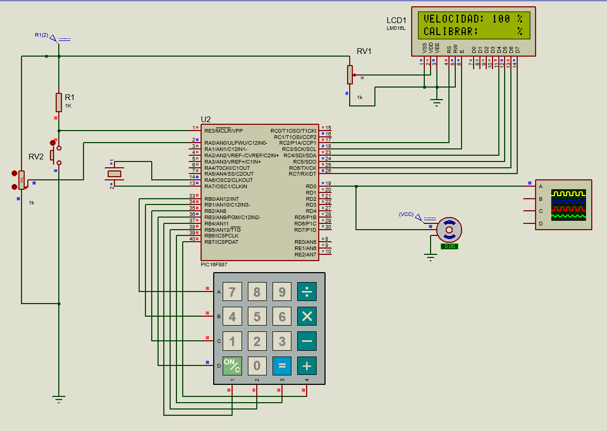
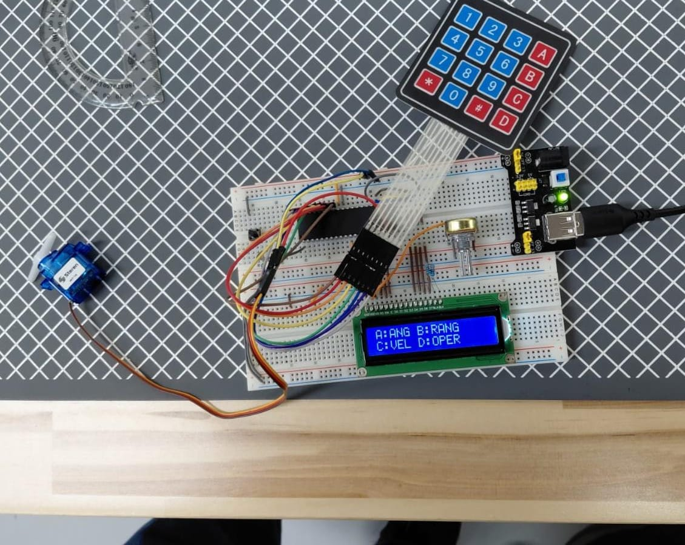

# Proyecto Final - Control de Servomotor MOT-100 con Keypad y LCD
Sistema de control avanzado de un servomotor Steren MOT-100 usando el microcontrolador PIC16F887, una interfaz de teclado matricial (keypad) y un display LCD 16x2. Permite al usuario definir ángulo exacto, rango de barrido, velocidad y operar el servo mediante un menú navegable desde el keypad.

---
## Descripción general
El sistema presenta un menú principal con cuatro modos de operación accesibles desde el keypad:

| Tecla | Modo | Función |
|---|---|---|
| A | ÁNGULO | Mover el servo a un ángulo exacto de forma instantánea |
| B | RANGO | Definir los extremos A1 y A2 del barrido (0-180°) |
| C | VELOCIDAD | Definir la velocidad de barrido en porcentaje (1-100%) |
| D | OPERAR | Iniciar el barrido continuo entre A1 y A2 |

Dentro de cada modo, la tecla propia del modo regresa al menú principal, `*` confirma un valor capturado y `#` borra el último dígito o detiene la operación.

---
## Características del sistema
 - Calibración no lineal del servo mediante una tabla de 15 puntos medidos con transportador, ya que el MOT-100 no responde proporcionalmente al ancho del pulso. La función "Angulo_A_Pulso()" interpola linealmente entre los puntos de la tabla para calcular el pulso exacto de cualquier ángulo entre 0° y 180°.
 - Rango de pulso calibrado físicamente: 400µs = 0° y 2204µs = 180° (tope físico real del servo, no se puede exceder).
 - Generación del pulso PWM por software mediante un loop de bloques de "__delay_us(100)" en lugar de un loop de 1µs, reduciendo el overhead del compilador y mejorando la precisión del timing.
 - El servo se mantiene en posición enviando pulsos repetidos cada 20ms con "Mantener_Angulo()", evitando que pierda su posición por falta de señal.
 - Countdown visual de "3... 2... 1..." antes de iniciar el barrido, construido carácter por carácter sobre el LCD para simular una animación progresiva.
 - Validación de rango en tiempo real: si el usuario ingresa un valor mayor a 180° (ángulo/rango) o fuera de 1-100% (velocidad) y presiona `*`, el sistema muestra "ERROR / EXCEDIDO" por 1 segundo y limpia el buffer sin avanzar.

---
## Actividades
### Sistema completo - Control de servomotor con menú interactivo.
 - "Inicializar()" configura ANSEL y ANSELH en 0 para deshabilitar todas las entradas analógicas, establece RD0 como salida para la señal del servo, inicializa el keypad con "InitKeypad()" y el LCD con la estructura de pines del PORTC.
 - La navegación entre estados se implementa con un "switch(tecla)" en el main y funciones de estado independientes ("Estado_Angulo", "Estado_Rango", "Estado_Velocidad", "Estado_Oper"). Cada función tiene su propio while interno que captura teclas y solo retorna al main cuando el usuario presiona la tecla de regreso al menú.
 - "captura_t" es una estructura que agrupa un buffer de caracteres y su longitud para manejar la entrada numérica del keypad. "Captura_Valor()" convierte el buffer de dígitos a un entero multiplicando por potencias de 10, el mismo principio que se usa para separar dígitos con "/" y "%" en prácticas anteriores pero en sentido inverso.
 - El modo RANGO maneja dos capturas simultáneas (A1 y A2) usando un puntero "captura_t *activo" que apunta a c1 o c2 según el flag "capturando_a2". Al confirmar A1 con `*` el foco pasa automáticamente a A2 sin regresar al menú.
 - "Barrer(desde, hasta, delay_ms)" implementa el barrido paso a paso con revisión de teclas en cada ciclo de pulso. Si detecta `#` retorna "BARRIDO_DETENIDO" y si detecta `D` retorna "BARRIDO_MENU", permitiendo que "Estado_Oper_Corriendo()" decida qué hacer sin bloquear la interfaz durante el movimiento.
 - Cuando el barrido se detiene con `#`, el servo mantiene su posición actual mientras el sistema espera `*` para reiniciar el countdown o `D` para regresar al menú. Al reanudar con `*` el barrido continúa desde la posición donde se detuvo.
 - "Velocidad_A_Delay(vel)" mapea el porcentaje de velocidad (1-100%) al delay entre pasos usando la fórmula "delay_ms = 50 - (vel * 0.45)". Se implementa con aritmética entera multiplicando por 45 y dividiendo entre 100 para evitar el uso de float: "delay = 50 - (vel * 45) / 100".
 - "LCD_Numero(int numero)" convierte un entero a texto sin usar "sprintf" ni la librería estándar, extrayendo dígitos con módulo y división sucesivos, invirtiendo el orden con un buffer temporal y enviando cada carácter con "LCD_putc()". Esto evita dependencias de stdio en el código del proyecto.
 - Si el usuario intenta entrar a OPERAR sin haber definido el rango o la velocidad, el sistema muestra "FALTA CALIBRAR" y espera que el usuario presione `D` para regresar al menú sin iniciar ningún barrido.

  **Codigo:**   [main.c](./main.c)

  **Esquematico:**  

  **Circuito:**  

---
## Observaciones
- La no linealidad del servo MOT-100 hace que una fórmula de mapeo simple no sea suficiente para posicionar su angulo con suficiente precisión usando un mapeo lineal común. Por esta razon realiazmos una tabla de calibración entre puntos medidos físicamente para mayor presición.
- "__delay_us()" en XC8 solo acepta constantes en tiempo de compilación, por lo que generar pulsos de ancho variable con esta función directamente es imposible. El loop de bloques de "__delay_us(100)" resuelve esta restricción reduciendo además el overhead acumulado respecto a un loop de "__delay_us(1)".
- Revisar el keypad dentro del loop de barrido en lugar de usar interrupciones permite responder a las teclas sin interrumpir el pulso PWM en curso, evitando que el servo reciba un pulso incompleto que cause un movimiento brusco.
- El uso de funciones de estado independientes con su propio while interno hace que el código sea modular y fácil de extender: agregar un nuevo modo solo requiere crear una nueva función y un nuevo case en el switch del main.
- "LCD_Numero()" sin sprintf evita incluir la librería estándar de C completa solo para formatear números, ahorrando memoria de programa en un microcontrolador con recursos limitados.
